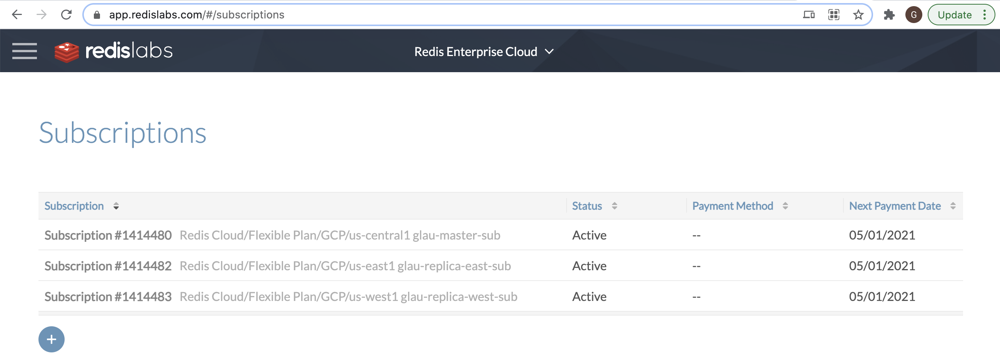
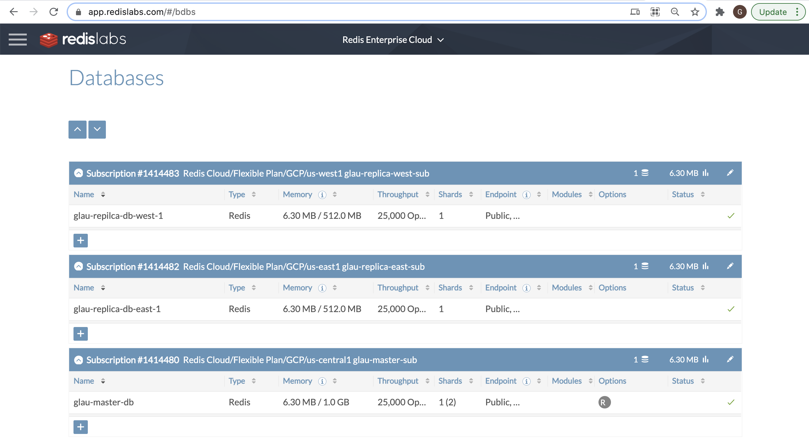
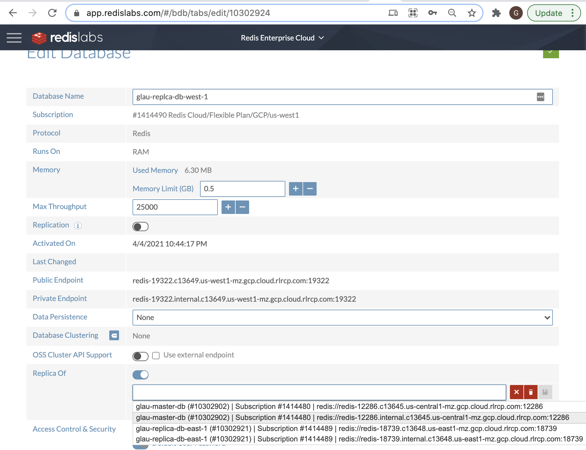
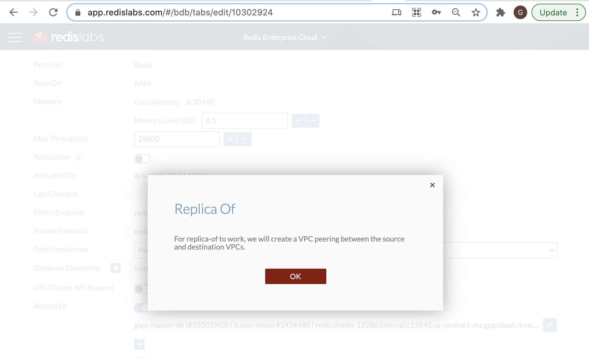
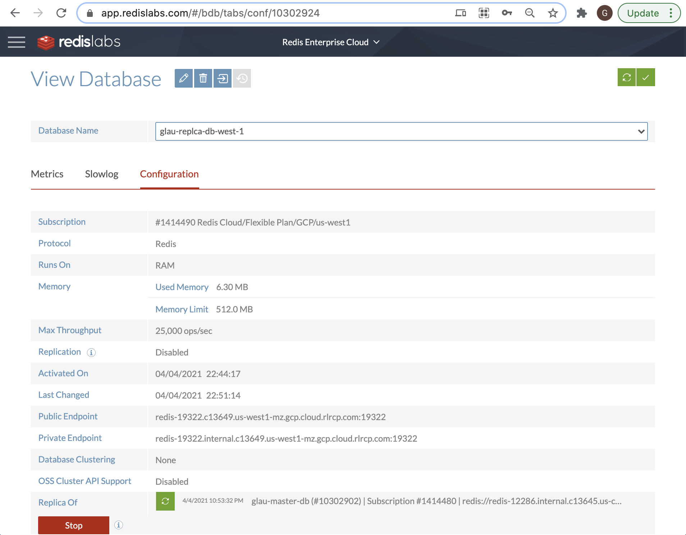
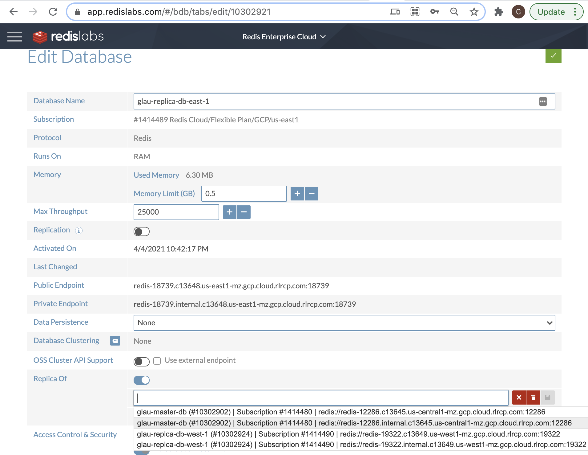
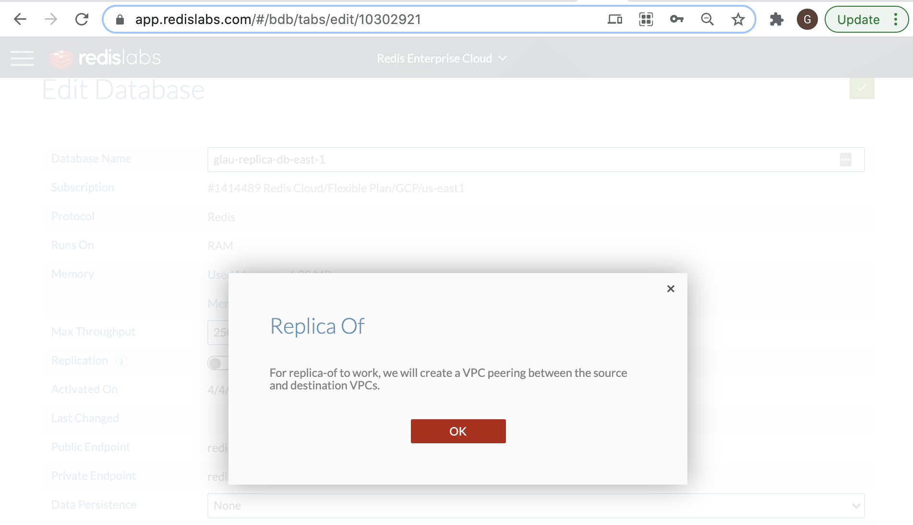
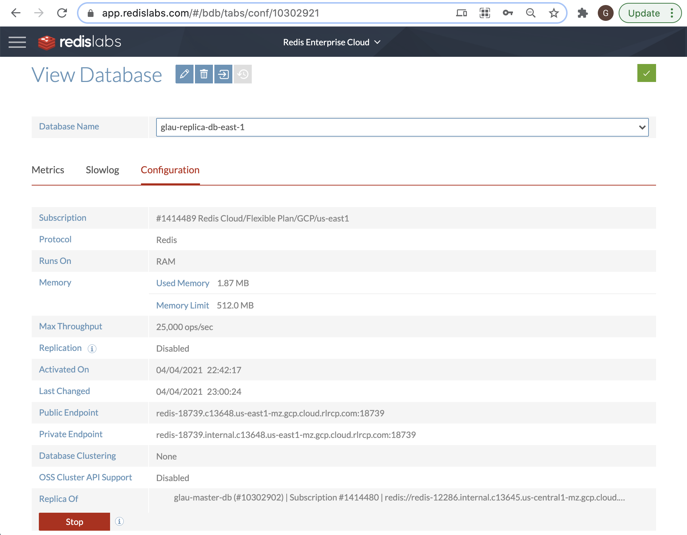
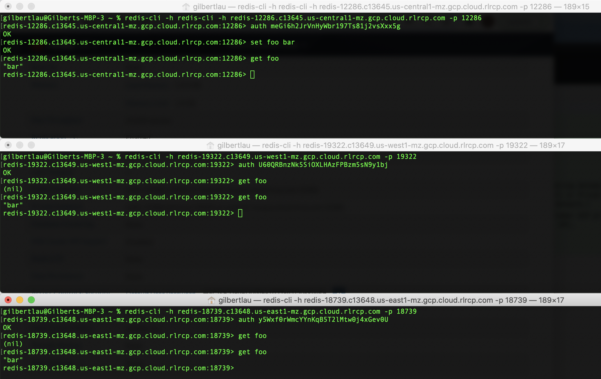

### Active-Passive Geo Distribution (1 R/W master + 2 Read-only replicas)

Setup topology:
* One master read/write database in us-central1
* One read-only replica database in us-west1
* One read-only replica database in us-east1
* Make sure each of the subscription does not have overlapping deployment CIDR ranges

Master r/w databse (namely glau-master-db) configuration:
* GCP Region: us-central1
* Size 1 GB RAM only
* Replication: Yes
* Deployment CIDR: 192.168.0.0/24

Read-only replica database (namely glau-replca-db-west-1) configuration:
* GCP Region: us-west1
* Size 0.5 GB RAM only
* Replciation: No
* Deployment CIDR: 10.2.0.0/24

Read-only replica database (namely glau-replica-db-east-1) configuraiton:
* GCP Region: us-east1
* Size 0.5 GB RAM only
* Replication: No
* Deployment CIDR: 10.4.0.0/24

Below are the three GCP Marketplace subscriptions for each of the regional deployments:

Below are the databases for the Active-Passive Geo Distribution Setup:

Set up glau-replica-db-west-1 as the first replica of the glau-master-db.  Select glau-master-db (using internal IP address) from the drop-down listbox as follows:

After hitting **OK** (disk icon) button, the following screen will appear:

Then proceed to press the "Update" button to complete the operation. If the request was successful, it will show the status in the **Replica Of** field as follows:

Now, set up glau-replica-db-east-1 as the second replica of the glau-master-db.  Select glau-master-db (using internal IP address) from the drop-down listbox as follows:

After hitting **OK** (disk icon) button, the following screen will appear:

Then proceed to press the "Update" button to complete the operation. If the request was successful, it will show the status in t
he **Replica Of** field as follows:

Finally, run "set foo bar" command on the glau-master-db and see the data being replicated to the two replicas as shown below:

