## Accessing a Redis Enterprise database in GCP Marketplace from GCP Cloud Run 

This repo details the necessary steps to connect to a Redis Enterprise database (REDB) instance in GCP Marketplace from GCP Cloud Run. 

## High Level Workflow
The following is the high level workflow which you will follow:
1. Collect the connection parameters of an existing REDB instance
2. Identify the VPC network peered with the Redis' VPC network containing the REDB instance
3. Create a VPC access connector to the VPC network
4. Create a Cloud Run instance
5. Verify REDB connection from the Cloud Run instance to the REDB instance

#### 1. Collect the connection parameters of an existing REDB instance
Follow the screen shots below to locate the necessary connection parameters  
Collect the **Private endpoint**:
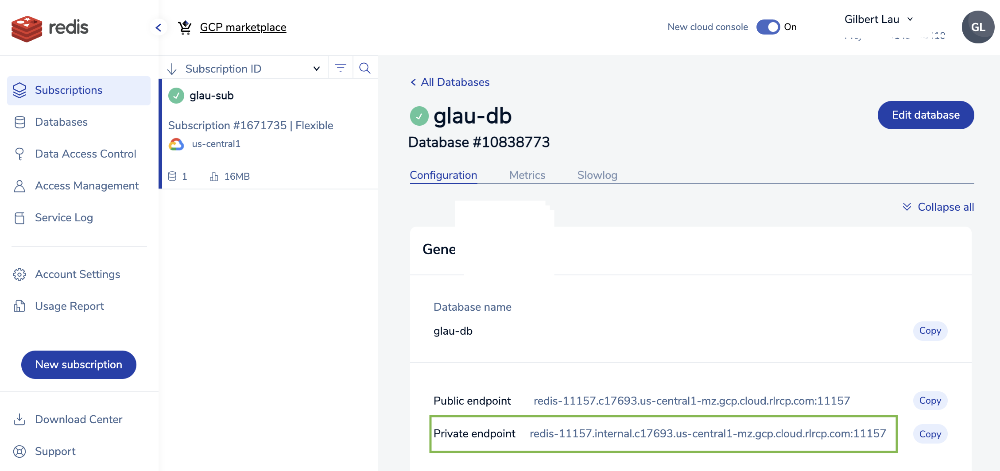
   
Collect the **Default user password**:
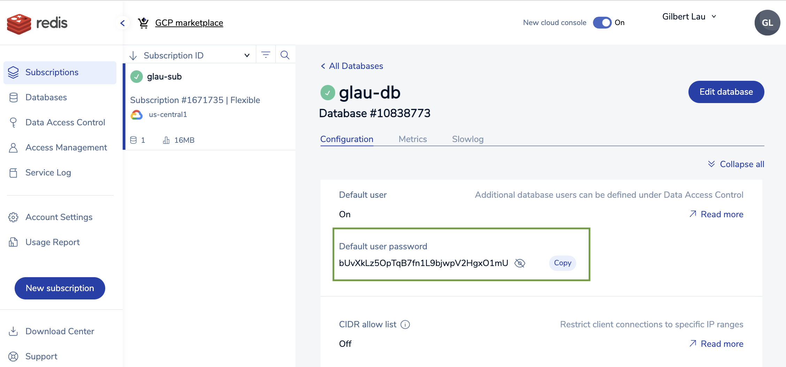

#### 2. Identify the VPC network peered with the Redis' VPC network containing the REDB instance
Collect the **Project ID** and **Network name**  as follows:
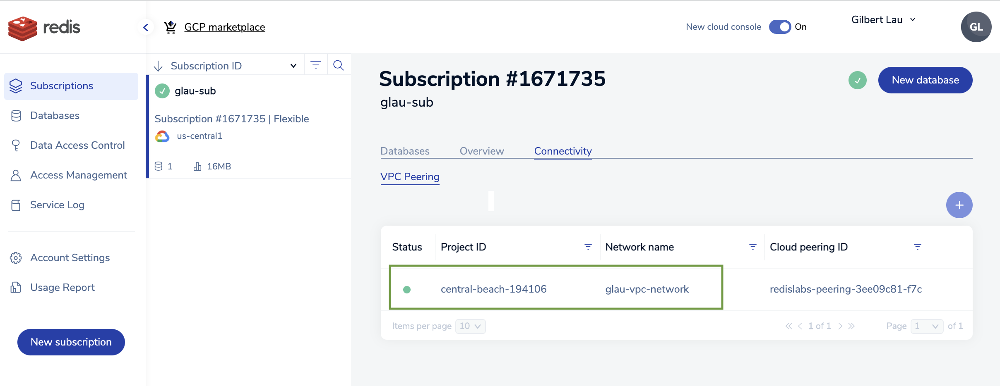    

#### 3. Create a VPC access connector to the VPC network
Make sure to use the same VPC network **(glau-vpc-network)** collected in step 2 when creating the VPC access connector:
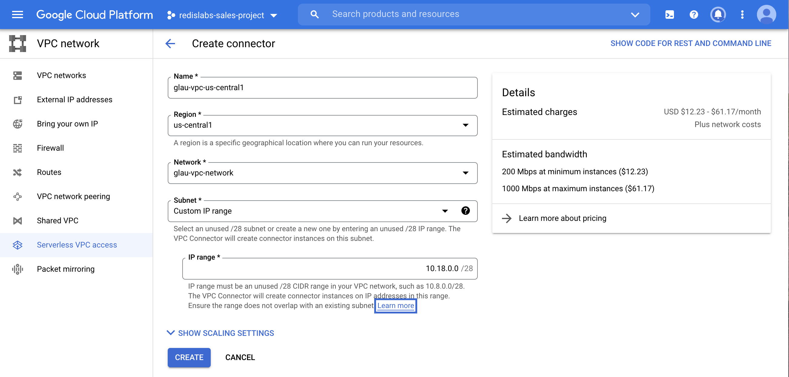
*Please note that the connector is created in the same region **us-central1** as the REDB instance for low latency purpose.*

#### 4. Create a Cloud Run instance
Pick an exisitng container which will connect to the REDB instance to increment a **counter** key:
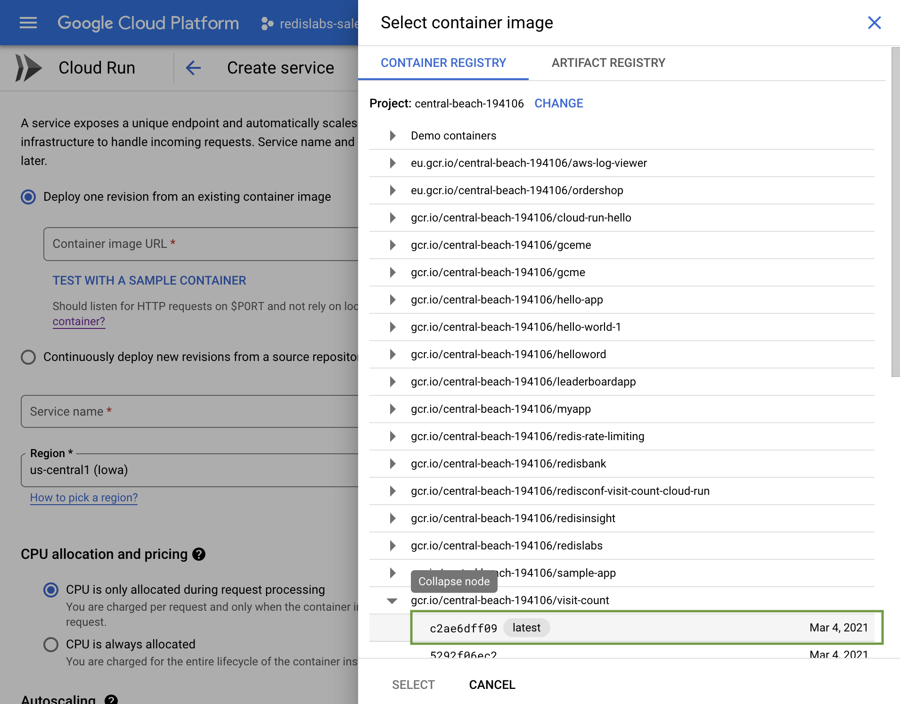  
It is a sample application listening at port 80 to keep count of RedisConf 2021 visitors.  
     
Rename the **Service name** to **visit-counter**:
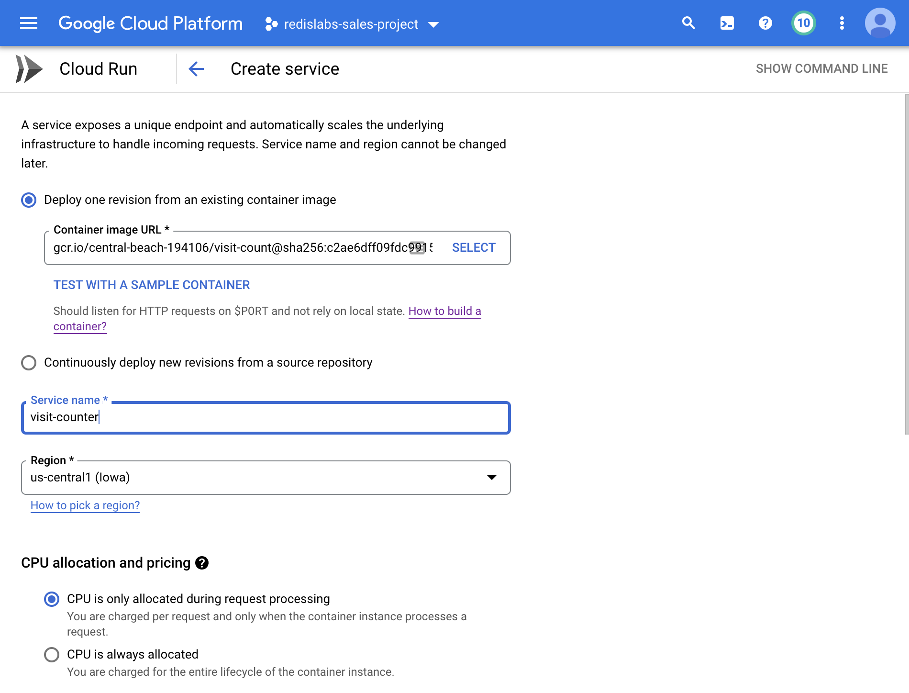
   
Do not forget to scroll down a bit further and check the **Allow unauthorized invocations** option.  
     
Expand **Container, Variables & Secrets, Connections, Security** section:   
Change the **Container port** to **80** under **CONTAINER** tab:
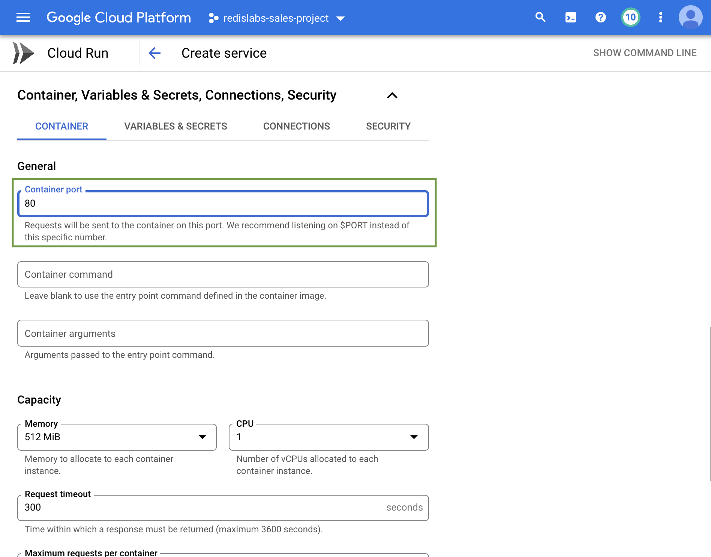
     
Select **VARIABLES & SECRETS** tab and create three Environment variables as follows:  
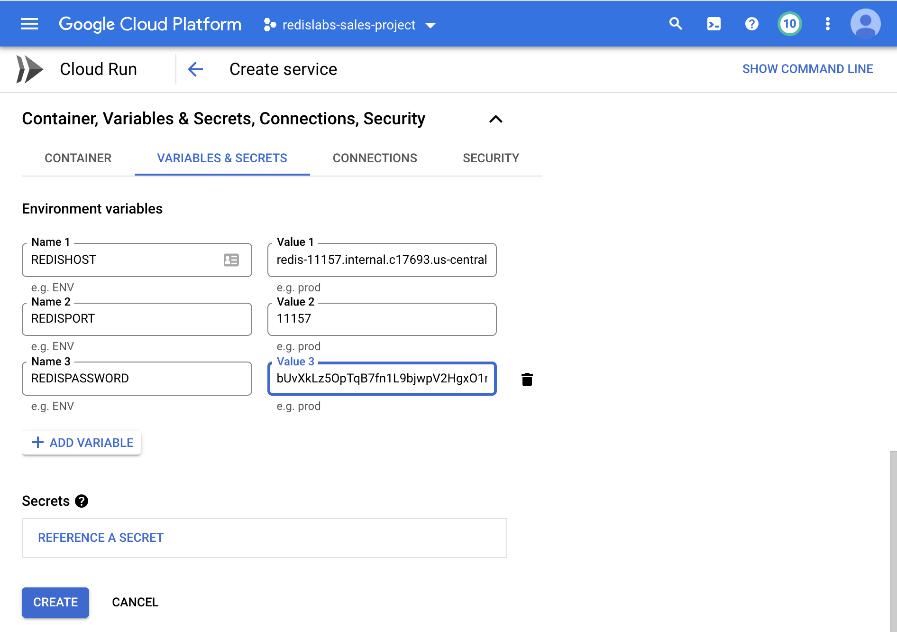
        
Select **CONNECTIONS** tab and choose the VPC access connector it was just created earlier like below:
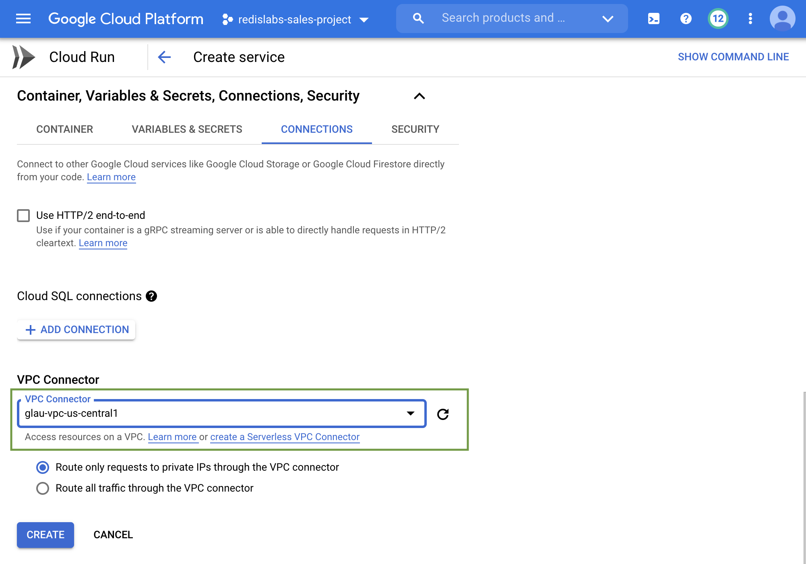
    
Finally, press the **CREATE** button to create the Cloud Run instance. The first revision of the Cloud Run instance is ready to serve:
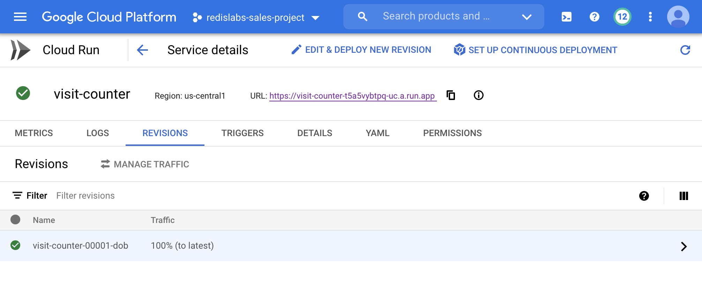
   
  
#### 5. Verify REDB connection from the Cloud Run instance to the REDB instance
Click on the Cloud Run **visitor-counter** URL to test the REDB connection:
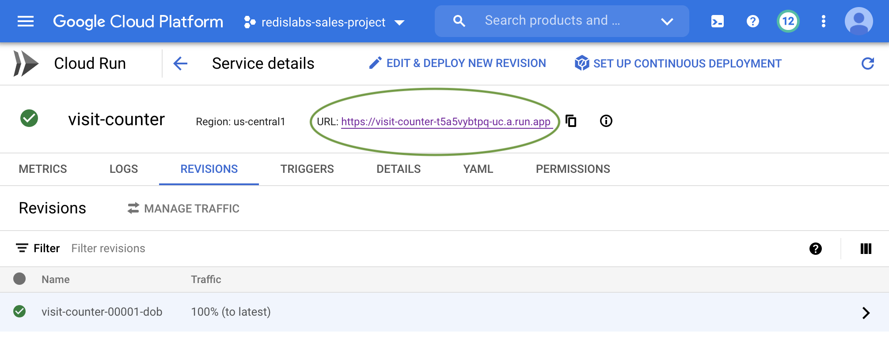
    
You should see the following **redisconf2021** webpage. If you refresh your browser, the **Visitor Number** will keep increasing by one.
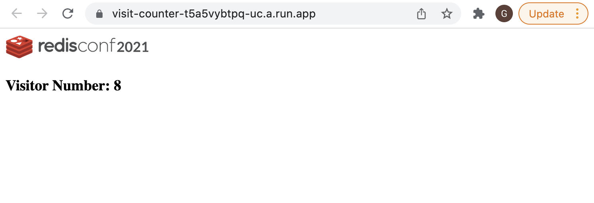

