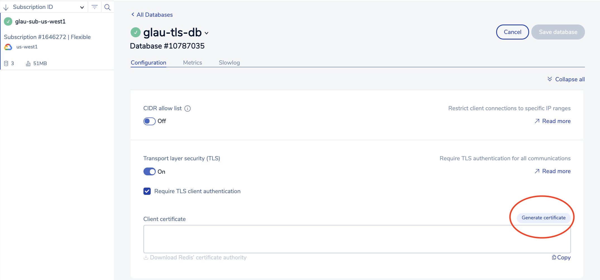
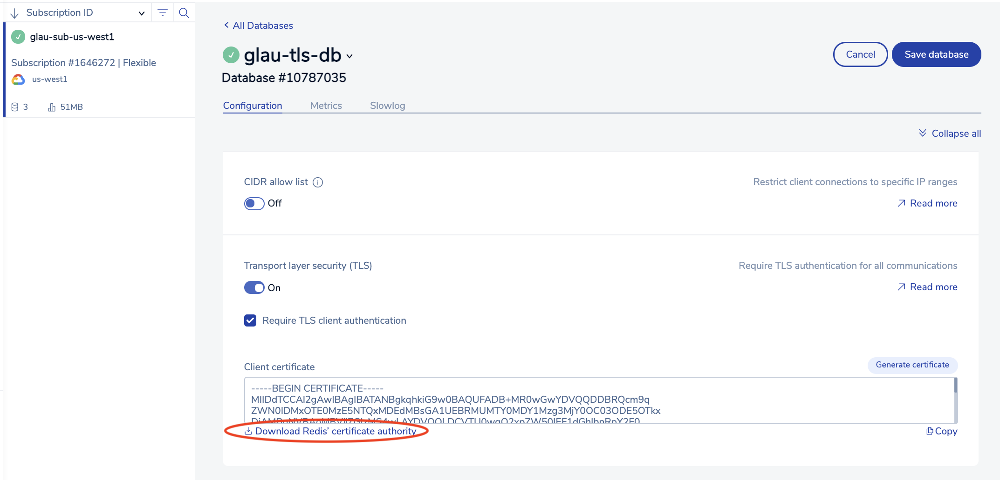
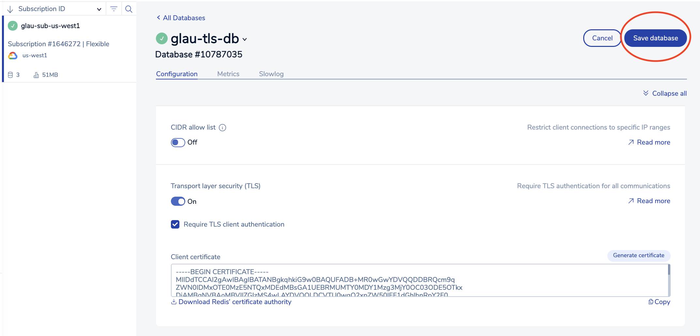

# Accessing a TLS-enabled Redis Enterprise database (REDB) in GCP Marketplace from an ASM GKE cluster via Istio egressgateway and TLS origination

## High Level Workflow
The following is the high level workflow which you will follow:
1. Create a GKE cluster
2. Install Anthos Service Mesh (ASM)
3. Create a TLS-enabled Redis Enterprise database (REDB) from GCP Marketplace
4. Unpack the downloaded TLS artifact package
5. Install Egress Gateway
6. Create relevant Kubernetes resources to configure TLS origination of the REDB via Egress Gateway
7. Create a namespace and label it for sidecar injection
8. Deploy a Redis client on the GKE cluster
9. Validate Egress Gateway's TLS origination for a secured mTLS REDB connection


#### 1. Create a GKE cluster
```
export PROJECT_ID=$(gcloud info --format='value(config.project)')
export CLUSTER_NAME="glau-asm-gke-cluster"
export CLUSTER_LOCATION=us-west1-a

gcloud beta container clusters create ${CLUSTER_NAME} \
  --zone=${CLUSTER_LOCATION} --num-nodes=3 \
  --image-type=COS_CONTAINERD \
  --machine-type=e2-standard-8 \
  --network=default \
  --enable-ip-alias \
  --enable-stackdriver-kubernetes
```


#### 2. Install Anthos Service Mesh (ASM)
Download ASM installation script
```
curl https://storage.googleapis.com/csm-artifacts/asm/install_asm_1.10 > install_asm
curl https://storage.googleapis.com/csm-artifacts/asm/install_asm_1.10.sha256 > install_asm.sha256
sha256sum -c --ignore-missing install_asm.sha256
chmod +x install_asm
```  
Note: If you are running the ASM install on MacOS, you will need to install kpt as follows:  
```
gcloud components install kpt
```  
Install Anthos Service Mesh (ASM)  
Please make sure you have all the required [GCP IAM permissions](https://cloud.google.com/service-mesh/docs/installation-permissions) before running the script below.  
```
./install_asm \
  --project_id $PROJECT_ID \
  --cluster_name $CLUSTER_NAME  \
  --cluster_location $CLUSTER_LOCATION  \
  --mode install \
  --output_dir ./asm-downloads \
  --enable_all
```


#### 3. Create a TLS-enabled Redis Enterprise database (REDB) from GCP Marketplace
Assuming you have created a REDB instance in GCP Marketplace. The following will demonstrate how to enable mTLS and download the required key and certificates for secure connection.  
&nbsp;  
- Turn On "Transport layer security (TLS)" and check "Required TLS client authentiation"  

   
- Click the "Generate certificate" button

  
- Click the "Download Redis' certificate authority" link

  
- Click the "Save database" button

   
- Collect the following connection parameters for the TLS-enabled REDB:  
  - Public endpoint (For example, redis-10365.c17257.us-west1-mz.gcp.cloud.rlrcp.com:10365)
  - Default user password   
  

#### 4. Unpack the downloaded TLS artifact package
Unzip the redislabs_credentials.zip file:
```
unzip redislabs_credentials.zip

Archive:  redislabs_credentials.zip
 extracting: redislabs_user.crt      
 extracting: redislabs_user_private.key  
 extracting: redislabs_ca.pem   
```


#### 5. Install Egress Gateway
Create a nodepool for the egress gateway:
```
gcloud container node-pools create "gateway" \
--cluster ${CLUSTER_NAME} \
--machine-type "e2-standard-4" \
--node-taints dedicated=gateway:NoSchedule \
--zone=${CLUSTER_LOCATION} \
--num-nodes "1"
```
Download istioctl for your operating system and extract into your working directory:  
Follow this [link](https://cloud.google.com/service-mesh/docs/downloading-istioctl#linux) for Linux.  
Follow this [link](https://cloud.google.com/service-mesh/docs/downloading-istioctl#mac-os) for Mac OS.  
For Mac OS:  
Download the ASM installation file which matches your ASM version:  
```
curl -LO https://storage.googleapis.com/gke-release/asm/istio-1.10.4-asm.14-osx.tar.gz
```
Download the signature file and use openssl to veify the signature:
```
curl -LO https://storage.googleapis.com/gke-release/asm/istio-1.10.4-asm.14-osx.tar.gz.1.sig
openssl dgst -sha256 -verify /dev/stdin -signature istio-1.10.4-asm.14-osx.tar.gz.1.sig istio-1.10.4-asm.14-osx.tar.gz <<'EOF'
-----BEGIN PUBLIC KEY-----
MFkwEwYHKoZIzj0CAQYIKoZIzj0DAQcDQgAEWZrGCUaJJr1H8a36sG4UUoXvlXvZ
wQfk16sxprI2gOJ2vFFggdq3ixF2h4qNBt0kI7ciDhgpwS8t+/960IsIgw==
-----END PUBLIC KEY-----
EOF
```
The expected output is: Verified OK.  
Extract the contents and change to the installation's root directory:
```
tar xzf istio-1.10.4-asm.14-osx.tar.gz
```
Install the egress gateway: 
```
cat > istio-operator-egress-gateway.yaml <<EOF
apiVersion: install.istio.io/v1alpha1
kind: IstioOperator
metadata:
  name: "egress-gateway"
spec:
  profile: empty # Do not install CRDs or the control plane
  revision: asm-1104-14 # Update to match your current revision, and after moving to a new revision
  components:
    egressGateways:
      - name: "istio-egressgateway"
        enabled: true
        namespace: "istio-system"
        label:
          istio: "egress"
        k8s:
          service:
            ports:
              - name: redis-tls-16379
                port: 16379
                targetPort: 16379
          tolerations:
          - key: "dedicated"
            operator: "Equal"
            value: "gateway"
          nodeSelector:
            cloud.google.com/gke-nodepool: "gateway"
  values:
    gateways:
      istio-egressgateway:
        # Enable gateway injection
        injectionTemplate: gateway
        runAsRoot: True
EOF
```
```
./istio-1.10.4-asm.14/bin/istioctl install -f istio-operator-egress-gateway.yaml
```
The output should look like the following:
```
This will install the Istio 1.10.4 empty profile into the cluster. Proceed? (y/N) y
✔ Egress gateways installed
✔ Installation complete                                                                                                    
Thank you for installing Istio 1.10.  Please take a few minutes to tell us about your install/upgrade experience!
```
Verify if the port 16379 has been created on the egree gateway:
```
kubectl get svc istio-egressgateway -n istio-system
  
NAME                  TYPE        CLUSTER-IP     EXTERNAL-IP   PORT(S)     AGE
istio-egressgateway   ClusterIP   10.116.0.229   <none>        16379/TCP   53s
```


#### 6. Create relevant Kubernetes resources to configure TLS origination of the REDB via Egress Gateway
Create a service entry for the REDB:
```
kubectl apply -f - <<EOF
apiVersion: networking.istio.io/v1alpha3
kind: ServiceEntry
metadata:
  name: redis-tls-16146-se
  namespace: istio-system
spec:
  hosts:
  - redis-16146.c17385.us-central1-mz.gcp.cloud.rlrcp.com
  ports:
  - number: 16146
    name: tcp-redis-tls-16146
    protocol: TCP
  resolution: DNS
  location: MESH_EXTERNAL
EOF
```
Create a destination rule for the REDB:
```
kubectl apply -f - <<EOF
apiVersion: networking.istio.io/v1alpha3
kind: DestinationRule
metadata:
  name: redis-tls-16146-dr
  namespace: istio-system
spec:
  host: redis-16146.c17385.us-central1-mz.gcp.cloud.rlrcp.com
  trafficPolicy:
    tls:
      mode: MUTUAL
      credentialName: redis-client-tls-16146
EOF
```
Create a gateway to listen at port 16379:
```
kubectl apply -f - <<EOF
apiVersion: networking.istio.io/v1alpha3
kind: Gateway
metadata:
  name: redis-tls-egressgateway-16379
  namespace: istio-system
spec:
  selector:
    istio: egress
  servers:
  - port:
      number: 16379
      name: tcp-redis-tls-16379
      protocol: TCP
    hosts:
    - '*'
EOF
```
Create a virtual service for the REDB:
```
kubectl apply -f - <<EOF
apiVersion: networking.istio.io/v1alpha3
kind: VirtualService
metadata:
  name: redis-tls-16146-egress-vs
  namespace: istio-system
spec:
  hosts:
  - redis-16146.c17385.us-central1-mz.gcp.cloud.rlrcp.com
  gateways:
  - redis-tls-egressgateway-16379
  - mesh
  tcp:
  - match:
    - gateways:
      - mesh
      port: 16146
    route:
    - destination:
        host: istio-egressgateway.istio-system.svc.cluster.local
        port:
          number: 16379
      weight: 100
  - match:
    - gateways:
      - redis-tls-egressgateway-16379
      port: 16379
    route:
    - destination:
        host: redis-16146.c17385.us-central1-mz.gcp.cloud.rlrcp.com
        port:
          number: 16146
      weight: 100
EOF
```
Create a secret from the extracted TLS artificats from step 4 above for TLS origination:
```
kubectl -n istio-system create secret generic \
redis-client-tls-16146 --from-file=tls.key=redislabs_user_private.key \
--from-file=tls.crt=redislabs_user.crt --from-file=ca.crt=redislabs_ca.pem
```


#### 7. Create a namespace and label it for sidecar injection
```
kubectl -n istio-system get pods -l app=istiod --show-labels

kubectl create namespace redis
kubectl label namespace redis istio.io/rev=asm-1104-14
```


#### 8. Deploy a Redis client on the GKE cluster
```
cat << EOF | kubectl apply -f -
apiVersion: apps/v1
kind: Deployment
metadata:
  name: redis-client
  namespace: redis
  labels:
    app: redis-client
spec:
  replicas: 1
  selector:
    matchLabels:
      app: redis-client
  template:
    metadata:
      labels:
        app: redis-client
      annotations:
        sidecar.istio.io/logLevel: debug
        sidecar.istio.io/inject: "true"                                                                                     
    spec:
      containers:
        - image: redis
          name: redis-client
          command: [ "/bin/bash", "-c", "--" ]
          args: [ "while true; do sleep 30; done;" ]
EOF
```
  

#### 9. Validate Egress Gateway's TLS origination for a secured mTLS REDB connection
Get a shell to the redis-client container:
```
kubectl exec -ti -n redis deploy/redis-client -c redis-client -- bash
```
Connect to the TLS REDB instance with TLS origination configured through the Egress Gateway:
```
redis-cli -h <REPLACE_WITH_REDIS_HOST> -p <REPLACE_WITH_REDIS_PORT> -a <REPLACE_WITH_DEFAULT_USER_PASSWORD>

In my example,
redis-cli -h redis-16146.c17385.us-central1-mz.gcp.cloud.rlrcp.com -p 16146 -a [REDACTED]

Create a key-value pair:
set "watch" "rolex"
get "watch"

It shoud return "rolex"
```

