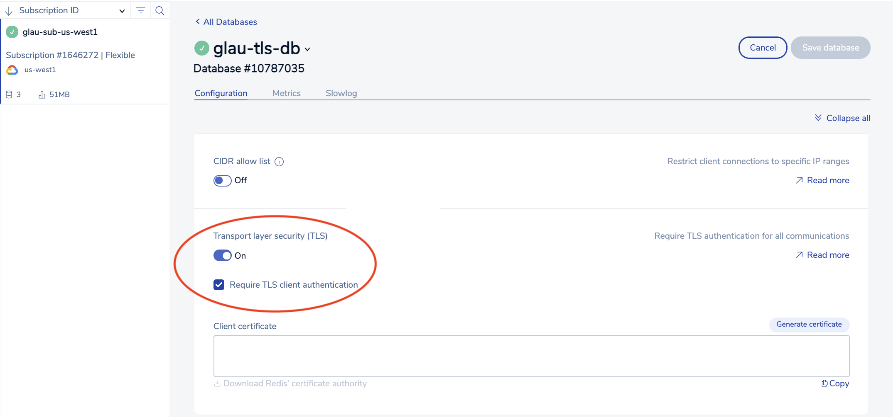

# Accessing a TLS-enabled Redis Enterprise database (REDB) in GCP Marketplace from an ASM GKE cluster via Istio proxy sidecar's TLS origination

## High Level Workflow
The following is the high level workflow which you will follow:
1. Create a GKE cluster
2. Install Anthos Service Mesh (ASM)
3. Create a TLS-enabled Redis Enterprise database (REDB) from GCP Marketplace
4. Unpack the downloaded TLS artifact package
5. Create a namespace and label it for sidecar injection
6. Create a secret to store the client certificate, client key and service certificate
7. Deploy a Redis client on the GKE cluster
8. Create Istio resources (ServiceEntry and DestinationRule) for the TLS-enabled REDB
9. Validate Istio proxy sidecar's TLS origination for a secured mTLS REDB connection


#### 1. Create a GKE cluster
```
export PROJECT_ID=$(gcloud info --format='value(config.project)')
export CLUSTER_NAME="glau-asm-gke-cluster"
export CLUSTER_LOCATION=us-west1-a

gcloud beta container clusters create ${CLUSTER_NAME} \
  --zone=${CLUSTER_LOCATION} --num-nodes=3 \
  --image-type=COS_CONTAINERD \
  --machine-type=e2-standard-8 \
  --network=default \
  --enable-ip-alias \
  --enable-stackdriver-kubernetes
```


#### 2. Install Anthos Service Mesh (ASM)
Download ASM installation script
```
curl https://storage.googleapis.com/csm-artifacts/asm/install_asm_1.10 > install_asm
curl https://storage.googleapis.com/csm-artifacts/asm/install_asm_1.10.sha256 > install_asm.sha256
sha256sum -c --ignore-missing install_asm.sha256
chmod +x install_asm
```  
Note: If you are running the ASM install on MacOS, you will need to install kpt as follows:  
```
gcloud components install kpt
```  
Install Anthos Service Mesh (ASM)  
Please make sure you have all the required [GCP IAM permissions](https://cloud.google.com/service-mesh/docs/installation-permissions) before running the script below.  
```
./install_asm \
  --project_id $PROJECT_ID \
  --cluster_name $CLUSTER_NAME  \
  --cluster_location $CLUSTER_LOCATION  \
  --mode install \
  --output_dir ./asm-downloads \
  --enable_all
```


#### 3. Create a TLS-enabled Redis Enterprise database (REDB) from GCP Marketplace
Assuming you have created a REDB instance in GCP Marketplace. The following will demonstrate how to enable mTLS and download the required key and certificates for secure connection.  
&nbsp;  
- Turn On "Transport layer security (TLS)" and check "Required TLS client authentiation"  

   
- Click the "Generate certificate" button

  
- Click the "Download Redis' certificate authority" link

  
- Click the "Save database" button

   
- Collect the following connection parameters for the TLS-enabled REDB:  
  - Public endpoint (For example, redis-10365.c17257.us-west1-mz.gcp.cloud.rlrcp.com:10365)
  - Default user password   
  

#### 4. Unpack the downloaded TLS artifact package
Unzip the redislabs_credentials.zip file:
```
unzip redislabs_credentials.zip

Archive:  redislabs_credentials.zip
 extracting: redislabs_user.crt      
 extracting: redislabs_user_private.key  
 extracting: redislabs_ca.pem   
```


#### 5. Create a namespace and label it for sidecar injection
```
kubectl -n istio-system get pods -l app=istiod --show-labels

kubectl create namespace redis
kubectl label namespace redis istio.io/rev=asm-1104-14
```


#### 6. Create a secret to store the client certificate, client key and service certificate
Set the following environment variables:
```
In my example,
export REDIS_HOST=redis-10365.c17257.us-west1-mz.gcp.cloud.rlrcp.com
export REDIS_PORT=10365
```
Create the secret:
```
kubectl -n redis create secret generic \
redis-client-${REDIS_PORT} --from-file=redislabs_user_private.key \
--from-file=redislabs_user.crt --from-file=redislabs_ca.pem
```


#### 7. Deploy a Redis client on the GKE cluster
```
cat << EOF | kubectl apply -f -
apiVersion: apps/v1
kind: Deployment
metadata:
  name: redis-client
  namespace: redis
  labels:
    app: redis-client
spec:
  replicas: 1
  selector:
    matchLabels:
      app: redis-client
  template:
    metadata:
      labels:
        app: redis-client
      annotations:
        sidecar.istio.io/logLevel: debug
        sidecar.istio.io/inject: "true"                                                                                     
        sidecar.istio.io/userVolumeMount: '[{"name":"redis-client-${REDIS_PORT}", "mountPath":"/etc/ssl/redis-${REDIS-PORT}/certs", "readonly":true}]'
        sidecar.istio.io/userVolume: '[{"name":"redis-client-${REDIS_PORT}", "secret":{"secretName":"redis-client-${REDIS_PORT}"}}]'
    spec:
      containers:
        - image: redis
          name: redis-client
          command: [ "/bin/bash", "-c", "--" ]
          args: [ "while true; do sleep 30; done;" ]
EOF
```
  

#### 8. Create Istio resources (ServiceEntry and DestinationRule) for the TLS-enabled REDB
Create ServiceEntry resource:
```
cat <<EOF | kubectl apply --namespace=redis -f -
apiVersion: networking.istio.io/v1beta1
kind: ServiceEntry
metadata:
  name: external-tls-redis-${REDIS_PORT}
  namespace: redis
spec:
  hosts:
  - ${REDIS_HOST}
  location: MESH_EXTERNAL
  resolution: DNS
  ports:
  - number: ${REDIS_PORT}
    name: tcp-redis
    protocol: TCP
EOF
```
Create DestinationRule resource:
```
cat <<EOF | kubectl apply -f -
apiVersion: networking.istio.io/v1beta1
kind: DestinationRule
metadata:
  name: external-tls-redis-${REDIS_PORT}
  namespace: redis
spec:
  host: ${REDIS_HOST}
  trafficPolicy:
    tls:
      mode: MUTUAL
      clientCertificate: /etc/ssl/redis-${REDIS_PORT}/certs/redislabs_user.crt
      privateKey: /etc/ssl/redis-${REDIS_PORT}/certs/redislabs_user_private.key
      caCertificates: /etc/ssl/redis-${REDIS_PORT}/certs/redislabs_ca.pem
EOF
```
    

#### 9. Validate Istio proxy sidecar's TLS origination for a secured mTLS REDB connection
Get a shell to the redis-client container:
```
kubectl exec -ti deploy/redis-client -c redis-client -- bash
```
Connect to the TLS-enabled REDB instance with TLS origination configured in the Istio proxy sidecar:
```
redis-cli -h <REPLACE_WITH_REDB_IP> -p <REPLACE_WITH_REDB_PORT> -a <REPLACE_WITH_DEFAULT_USER_PASSWORD>

In my example,
redis-cli -h redis-10365.c17257.us-west1-mz.gcp.cloud.rlrcp.com -p 10365 -a [REDACTED]

Create a key-value pair:
set "watch" "rolex"
get "watch"

It shoud return "rolex"
```

