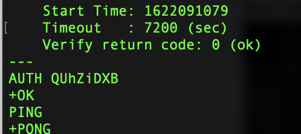

# Accessing a Redis Enterprise database from outside a GKE cluster (Through Anthos Service Mesh Ingress )

## High Level Workflow
The following is the high level workflow which you will follow:
1. Open a GCP Cloud Shell
2. Create a GKE cluster
3. Install Anthos Service Mesh (ASM)
4. Create a namespace for this deployment and deploy the Redis Enterprise Operator bundle
5. Deploy a Redis Enterprise Cluster (REC)
6. Deploy Ingress Gateway and Create routes for Redis Enterprise Cluster's HTTPS web access
7. Access Redis Enterprise Cluster's console
8. Generate a SSL certificate for the Redis Enterprise database
9. Create a Redis Enterprise database instance with SSL/TLS enabled
10. Update Ingress Gateway to include Redis Enterprise Database instance
11. Verify SSL/TLS connection using openssl
12. Connect to the Redis Enterprise database over SSL/TLS via a Python program


#### 1. Open a GCP Cloud Shell
You will execute all the steps in this repo inside a GCP Cloud Shell.  
Active cloud shell by clicking on the button:  
   
  
You should see a Cloud Shell terminal provisioned at the bottom part of your browser:  
  
Then, clone this repo into your terminal:  
```
git clone https://github.com/gmflau/redis-enterprise-asm-ingress
cd redis-enterprise-asm-ingress
```


#### 2. Create a GKE cluster
```
export PROJECT_ID=$(gcloud info --format='value(config.project)')
export CLUSTER_NAME="glau-asm-gke-cluster"
export CLUSTER_LOCATION=us-west1-a

./create_cluster.sh $CLUSTER_NAME $CLUSTER_LOCATION
```


#### 3. Install Anthos Service Mesh (ASM)
Download ASM installation script
```
curl https://storage.googleapis.com/csm-artifacts/asm/install_asm_1.9 > install_asm
curl https://storage.googleapis.com/csm-artifacts/asm/install_asm_1.9.sha256 > install_asm.sha256
sha256sum -c --ignore-missing install_asm.sha256
chmod +x install_asm
```
Install Anthos Service Mesh (ASM)  
Please make sure you have all the required [GCP IAM permissions](https://cloud.google.com/service-mesh/docs/installation-permissions) before running the script below.  
```
./install_asm \
  --project_id $PROJECT_ID \
  --cluster_name $CLUSTER_NAME  \
  --cluster_location $CLUSTER_LOCATION  \
  --mode install \
  --output_dir ./asm-downloads \
  --enable_all
```


#### 4. Create a namespace for this deployment and deploy the Redis Enterprise Operator bundle
```
kubectl create namespace redis
kubectl config set-context --current --namespace=redis

kubectl apply -f https://raw.githubusercontent.com/RedisLabs/redis-enterprise-k8s-docs/v6.0.20-4/bundle.yaml
```


#### 5. Deploy a Redis Enterprise Cluster (REC)
```
kubectl apply -f - <<EOF
apiVersion: app.redislabs.com/v1alpha1
kind: RedisEnterpriseCluster
namespace: redis
metadata:
  name: rec
spec:
  nodes: 3
  persistentSpec:
    enabled: true
    storageClassName: "standard"
    volumeSize: 20Gi
EOF
```


#### 6. Deploy Ingress Gateway and Create routes for Redis Enterprise Cluster's HTTPS web access
Define gateway for HTTPS access:
```
export INGRESS_HOST=$(kubectl -n istio-system get service istio-ingressgateway \
       -o jsonpath='{.status.loadBalancer.ingress[0].ip}')
export SECURE_INGRESS_PORT=$(kubectl -n istio-system get service istio-ingressgateway \
       -o jsonpath='{.spec.ports[?(@.name=="https")].port}')

kubectl apply -f - <<EOF
apiVersion: networking.istio.io/v1alpha3
kind: Gateway
metadata:
  name: redis-gateway
spec:
  selector:
    istio: ingressgateway # use istio default ingress gateway
  servers:
  - port:
      number: ${SECURE_INGRESS_PORT}
      name: https
      protocol: HTTPS
    tls:
      mode: PASSTHROUGH
    hosts:
    - rec-ui.${INGRESS_HOST}.nip.io
EOF
```
Configure routes for traffic entering via the gateway:
```
kubectl apply -f - <<EOF
apiVersion: networking.istio.io/v1alpha3
kind: VirtualService
metadata:
  name: rec
spec:
  hosts:
  - rec-ui.${INGRESS_HOST}.nip.io
  gateways:
  - redis-gateway
  tls:
  - match:
    - port: ${SECURE_INGRESS_PORT}
      sniHosts:
      - rec-ui.${INGRESS_HOST}.nip.io
    route:
    - destination:
        host: rec-ui
        port:
          number: 8443
EOF
```


#### 7. Access Redis Enterprise Cluster's console
Grab the password for demo@redislabs.com user for accessing REC's configuration manager (CM):
```
kubectl get secrets -n redis rec -o jsonpath="{.data.password}" | base64 --decode
```
Access the CM's login page using the following URL:
```
https://rec-ui.<$INGRESS_HOST>.nip.io:443

For example:
https://rec-ui.34.83.116.191.nip.io:443
```
Log in using demo@redislabs.com and the password collected above to view the cluster information in CM.


#### 8. Generate a SSL certificate for the Redis Enterprise database
```
openssl genrsa -out client.key 2048
```
When running the following command, just hit ENTER for every question except to enter *.rec.&lt;$INGRESS_HOST&gt;.nip.io for Common Name`:
```
openssl req -new -x509 -key client.key -out client.cert -days 1826
```
Copy the content of proxy_cert.pem from one of the REC pods to your machine running **openssl** command later:
```
kubectl exec -it rec-0 -c redis-enterprise-node -n redis -- /bin/bash
cd /etc/opt/redislabs
more proxy_cert.pem
```


#### 9. Create a Redis Enterprise database instance with SSL/TLS enabled
Generate a K8 secret for the SSL/TLS certificate:
```
cp client.cert cert
kubectl create secret generic client-auth-secret-redb --from-file=./cert -n redis
```
Deploy a Redis Enterprise database:
```
kubectl apply -f - <<EOF
apiVersion: app.redislabs.com/v1alpha1
kind: RedisEnterpriseDatabase
namespace: redis
metadata:
  name: redis-enterprise-database
spec:
  memorySize: 100MB
  tlsMode: enabled
  clientAuthenticationCertificates:
  - client-auth-secret-redb
EOF
```

#### 10. Update Ingress Gateway to include Redis Enterprise Database instance
Define gateway for SSL access:
```
export INGRESS_HOST=$(kubectl -n istio-system get service istio-ingressgateway \
       -o jsonpath='{.status.loadBalancer.ingress[0].ip}')
export SECURE_INGRESS_PORT=$(kubectl -n istio-system get service istio-ingressgateway \
       -o jsonpath='{.spec.ports[?(@.name=="https")].port}')
export DB_PORT=$(kubectl get secrets -n redis redb-redis-enterprise-database \
       -o jsonpath="{.data.port}" | base64 --decode)

kubectl apply -f - <<EOF
apiVersion: networking.istio.io/v1alpha3
kind: Gateway
metadata:
  name: redis-gateway
spec:
  selector:
    istio: ingressgateway # use istio default ingress gateway
  servers:
  - port:
      number: ${SECURE_INGRESS_PORT}
      name: https
      protocol: HTTPS
    tls:
      mode: PASSTHROUGH
    hosts:
    - rec-ui.${INGRESS_HOST}.nip.io
    - redis-${DB_PORT}.demo.rec.${INGRESS_HOST}.nip.io
EOF
```
Configure routes for traffic entering via the gateway for the database:
```
kubectl apply -f - <<EOF
apiVersion: networking.istio.io/v1alpha3
kind: VirtualService
metadata:
  name: redis-${DB_PORT}
spec:
  hosts:
  - redis-${DB_PORT}.demo.rec.${INGRESS_HOST}.nip.io
  gateways:
  - redis-gateway
  tls:
  - match:
    - port: ${SECURE_INGRESS_PORT}
      sniHosts:
      - redis-${DB_PORT}.demo.rec.${INGRESS_HOST}.nip.io
    route:
    - destination:
        host: redis-enterprise-database
        port:
          number: ${DB_PORT}
EOF
```


#### 11. Verify SSL/TLS connection using openssl
Grab the password of the Redis Enterprise database:
```
kubectl get secrets -n redis redb-redis-enterprise-database \
-o jsonpath="{.data.password}" | base64 --decode
```
Run the following to open a SSL session:
```
openssl s_client -connect redis-${DB_PORT}.demo.rec.${INGRESS_HOST}.nip.io:${SECURE_INGRESS_PORT} \
-key client.key -cert client.cert -CAfile ./proxy_cert.pem \
-servername redis-${DB_PORT}.demo.rec.${INGRESS_HOST}.nip.io

For example,
openssl s_client -connect redis-11338.demo.rec.34.127.23.12.nip.io:443 \
-key client.key -cert client.cert -CAfile ./proxy_cert.pem \
-servername redis-11338.demo.rec.34.127.23.12.nip.io
``` 
You should see a similar output as follows. Replace &lt;redis-enterprise-database-password&gt; with your Redis Enterprise database instance's password. Make sure there is a space after the password on MacOS. See below:

Send a **PING** command by entering PING followed by a blank space before hitting the **RETURN** button:  



#### 12. Connect to the Redis Enterprise database over SSL/TLS via a Python program
Run test.py to verify SSL/TLS connection:
```
python test.py ${INGRESS_HOST} ${DB_PORT} <redis-enterprise-database-password>

For example,
python test.py 34.83.49.103 16667 QUhZiDXB 
```
It should produce output about the Redis Enterprise database's information as follows:

