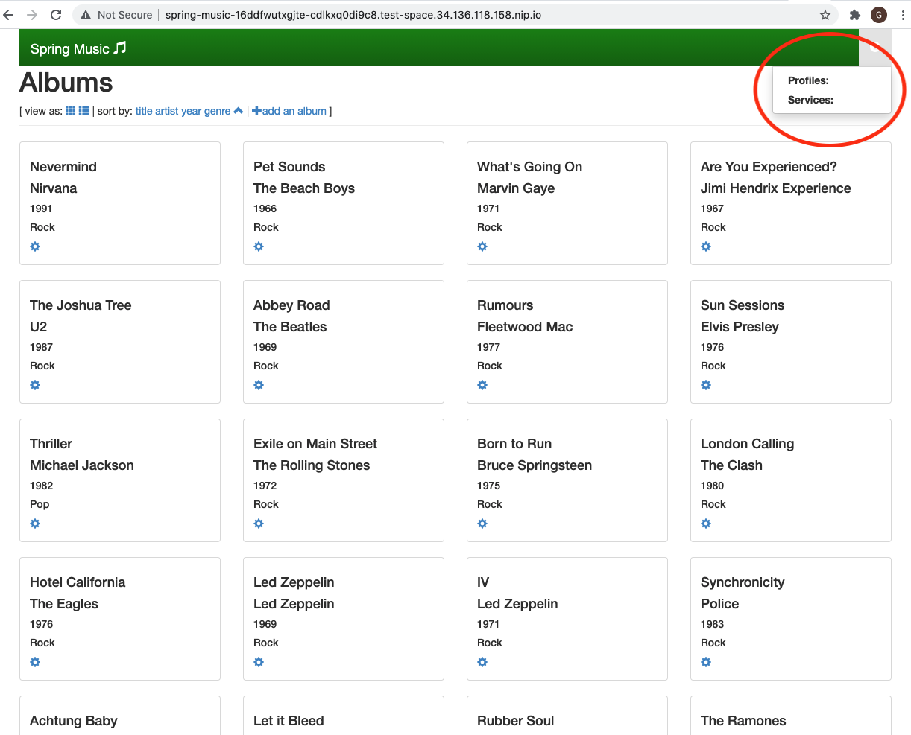
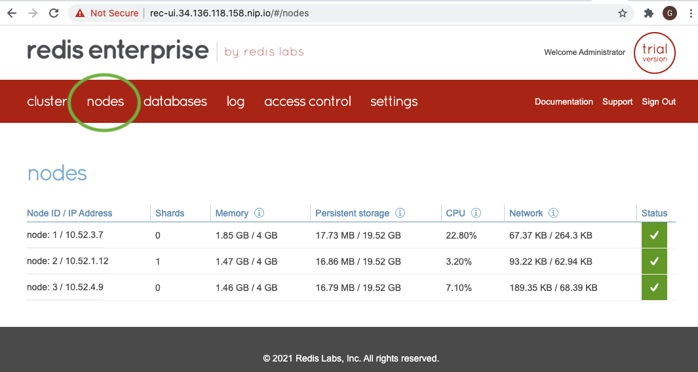
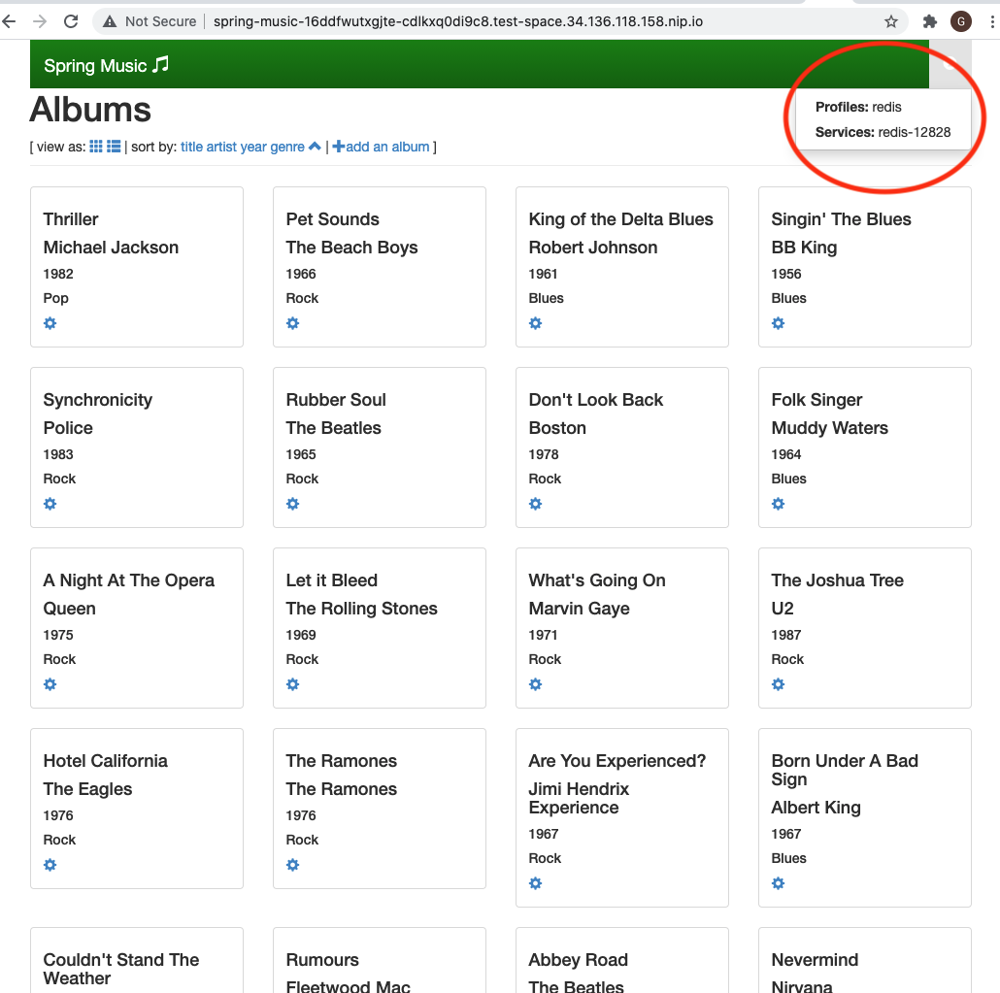

# Accessing Redis Enterprise Database from Google Cloud Platform's Kf environment through user provided service (TLS Origination's Istio Egress Gateway Edition)

## In this repo, you will learn how to:
1. Create a GKE cluster
2. Install Anthos Service Mesh (ASM) on the GKE cluster
3. Install Kf on the GKE cluster
4. Install Redis Enterprise Cluster on the GKE cluster
5. Expose Redis Enterprise Cluster admin console (a.k.a. CM) through Anthos Service Mesh via HTTPS port 443
6. Create a Redis Enterprise database with TLS (one-way SSL) enabled
7. Expose the TLS-enabled Redis Enterprise database through Anthos Service Mesh at TCP port 6379
8. Create a user provided service for the TLS-enabled Redis Enterprise database
9. Configure TLS origination for accessing the TLS-enabled Redis Enterprise database from within the GKE cluster under Anthos Service Mesh
10. Validate the setup using the Spring Music sample app
  
*Note: Kf 2.5 and ASM 1.10 are required*
  

## High Level Workflow
The following is the high level workflow which you will follow:
1. Create a GKE cluster for Kf
2. Install Anthos Service Mesh (ASM)
3. Install Config Connector
4. Set up workload identity
5. Install Tekton
6. Install Kf
7. Create a Kf space for testing the TLS origination configuration
8. Deploy the Spring Music sample app in Kf
9. Install Redis Enterprise Cluster
10. Deploy Ingress Gateway and Create routes for Redis Enterprise Cluster's HTTPS web access
11. Grab the password for demo@redislabs.com user for accessing REC's configuration manager (CM)
12. Create a Redis Enterprise Database with one-way SSL
13. Create Ingress Gateway and Virtual Service for the Redis Enterprise Database instance
14. Create a dedicated GKE node pool for the egress gateway
15. Create a namespace for Istio egress and label it for sidecar injection
16. Download istioctl for your operating system and extract into your working directory
17. Install Istio Egress Gateway
18. Configure TLS origination for the TLS-enabled Redis Enterprise database
19. Create a K8 secret from the Redis Enterprise database's proxy certificate
20. Create a user provided service in Kf
21. Bind the user provided service to the Spring Music sample app
22. Verify Spring Music app's data is being stored on the Redis Enterprise database


#### 1. Create a GKE cluster for Kf
Setup environment variables:
```
export PROJECT_ID=$(gcloud info --format='value(config.project)')
export CLUSTER_PROJECT_ID=$(gcloud info --format='value(config.project)')
export CLUSTER_NAME=glau-kf-asm-cluster
export COMPUTE_ZONE=us-central1-a
export COMPUTE_REGION=us-central1
export CLUSTER_LOCATION=${COMPUTE_ZONE}
export NODE_COUNT=5
export MACHINE_TYPE=e2-standard-8
export NETWORK=default
```  
  
Service account setup:    
Create the service account that Kf will use:
```
gcloud iam service-accounts create ${CLUSTER_NAME}-sa \
  --project=${CLUSTER_PROJECT_ID} \
  --description="GSA for Kf ${CLUSTER_NAME}" \
  --display-name="${CLUSTER_NAME}"
```
  
Create the service account that Kf will use:
Allow the service account to modify its own policy. The Kf controller will use this to add new (name)spaces to the policy, allowing reuse for Workload Identity:
```
gcloud iam service-accounts add-iam-policy-binding ${CLUSTER_NAME}-sa@${CLUSTER_PROJECT_ID}.iam.gserviceaccount.com \
  --project=${CLUSTER_PROJECT_ID} \
  --role="roles/iam.serviceAccountAdmin" \
  --member="serviceAccount:${CLUSTER_NAME}-sa@${CLUSTER_PROJECT_ID}.iam.gserviceaccount.com"
```
  
Give monitoring metrics role for write access to Cloud Monitoring:
```
gcloud projects add-iam-policy-binding ${CLUSTER_PROJECT_ID} \
  --member="serviceAccount:${CLUSTER_NAME}-sa@${CLUSTER_PROJECT_ID}.iam.gserviceaccount.com" \
  --role="roles/monitoring.metricWriter"
```
  
Give logging role for write access to Cloud Logging:
```
gcloud projects add-iam-policy-binding ${CLUSTER_PROJECT_ID} \
  --member="serviceAccount:${CLUSTER_NAME}-sa@${CLUSTER_PROJECT_ID}.iam.gserviceaccount.com" \
  --role="roles/logging.logWriter"
```
  
Create GKE cluster:  
```
gcloud beta container clusters create ${CLUSTER_NAME} \
  --project=${CLUSTER_PROJECT_ID} \
  --zone=${CLUSTER_LOCATION} \
  --num-nodes=${NODE_COUNT} \
  --machine-type=${MACHINE_TYPE} \
  --disk-size "122" \
  --network=${NETWORK} \
  --addons HorizontalPodAutoscaling,HttpLoadBalancing,GcePersistentDiskCsiDriver \
  --enable-dataplane-v2 \
  --enable-stackdriver-kubernetes \
  --enable-ip-alias \
  --enable-autorepair \
  --enable-autoupgrade \
  --scopes cloud-platform \
  --release-channel=regular \
  --workload-pool="${CLUSTER_PROJECT_ID}.svc.id.goog" \
 --service-account="${CLUSTER_NAME}-sa@${CLUSTER_PROJECT_ID}.iam.gserviceaccount.com"
```

Enable workload idenity:
```
gcloud iam service-accounts add-iam-policy-binding \
  --project=${CLUSTER_PROJECT_ID} \
  --role roles/iam.workloadIdentityUser \
  --member "serviceAccount:${CLUSTER_PROJECT_ID}.svc.id.goog[kf/controller]" \
  "${CLUSTER_NAME}-sa@${CLUSTER_PROJECT_ID}.iam.gserviceaccount.com"

gcloud iam service-accounts add-iam-policy-binding \
  --project=${CLUSTER_PROJECT_ID} \
  --role roles/iam.workloadIdentityUser \
  --member "serviceAccount:${CLUSTER_PROJECT_ID}.svc.id.goog[cnrm-system/cnrm-controller-manager]" \
  "${CLUSTER_NAME}-sa@${CLUSTER_PROJECT_ID}.iam.gserviceaccount.com"
```

Target GKE cluster:
```
gcloud container clusters get-credentials ${CLUSTER_NAME} \
    --project=${CLUSTER_PROJECT_ID} \
    --zone=${CLUSTER_LOCATION}
```
  
**Create an Artifact Registry repository:**  
Create an Artifact Registry for container images to be stored:
```
gcloud artifacts repositories create ${CLUSTER_NAME} \
  --project=${CLUSTER_PROJECT_ID} \
  --repository-format=docker \
  --location=${COMPUTE_REGION}
```  
Grant the service account permission on the Artifact Registry repository: 
```
gcloud artifacts repositories add-iam-policy-binding ${CLUSTER_NAME} \
  --project=${CLUSTER_PROJECT_ID} \
  --location=${COMPUTE_REGION} \
  --member="serviceAccount:${CLUSTER_NAME}-sa@${CLUSTER_PROJECT_ID}.iam.gserviceaccount.com" \
  --role='roles/artifactregistry.writer'
```


#### 2. Install Anthos Service Mesh (ASM)
Download ASM installation script
```
curl https://storage.googleapis.com/csm-artifacts/asm/install_asm_1.10 > install_asm
curl https://storage.googleapis.com/csm-artifacts/asm/install_asm_1.10.sha256 > install_asm.sha256
sha256sum -c --ignore-missing install_asm.sha256
chmod +x install_asm
```
Install Anthos Service Mesh (ASM)
Please make sure you have all the required [GCP IAM permissions](https://cloud.google.com/service-mesh/docs/installation-permissions) before running the script below.
```
./install_asm \
  --project_id $PROJECT_ID \
  --cluster_name $CLUSTER_NAME  \
  --cluster_location $CLUSTER_LOCATION  \
  --mode install \
  --output_dir ./asm-downloads \
  --enable_all
```
Add a custom port for Redis Enterprise database TLS connection to default ingress gateway:
```
kubectl edit svc istio-ingressgateway -n istio-system
```
Add the following next to the port definition section:
```
  - name: https-redis
    nodePort: 31379
    port: 6379
    protocol: TCP
    targetPort: 6379
```


#### 3. Install Config Connector
Note: Config Connector is required starting with Kf v2.4.0.  
Download the config connector installation artifacts:
```
curl -LO https://storage.googleapis.com/configconnector-operator/1.46.0/release-bundle.tar.gz --output release-bundle.tar.gz
tar zxvf release-bundle.tar.gz
```  
Install Config Connector operator:
```
kubectl apply -f operator-system/configconnector-operator.yaml
```  
Configure the Config Connector operator:  
```
kubectl apply -f - <<EOF
apiVersion: core.cnrm.cloud.google.com/v1beta1
kind: ConfigConnector
metadata:
  # the name is restricted to ensure that there is only one
  # ConfigConnector resource installed in your cluster
  name: configconnector.core.cnrm.cloud.google.com
spec:
  mode: cluster
  googleServiceAccount: ${CLUSTER_NAME}-sa@${CLUSTER_PROJECT_ID}.iam.gserviceaccount.com
EOF
```  
Verify the connector:  
Wait for a minute before running the following command:   
```
kubectl wait -n cnrm-system --for=condition=Ready pod --all
```
If success, you should see a similar output from the command:  
```
pod/cnrm-controller-manager-0 condition met
pod/cnrm-deletiondefender-0 condition met
pod/cnrm-resource-stats-recorder-86858dcdc5-g8h8c condition met
pod/cnrm-webhook-manager-58c799b8fb-d44xf condition met
```
  

#### 4. Set up workload identity
```
kubectl annotate serviceaccount \
--namespace cnrm-system \
--overwrite \
cnrm-controller-manager \
iam.gke.io/gcp-service-account=${CLUSTER_NAME}-sa@${CLUSTER_PROJECT_ID}.iam.gserviceaccount.com
```  
  

#### 5. Install Tekton
```
kubectl apply -f "https://storage.googleapis.com/tekton-releases/pipeline/previous/v0.23.0/release.yaml"
```  


#### 6. Install Kf
Install the Kf CLI:
```
Linux:
gsutil cp gs://kf-releases/v2.5.0/kf-linux /tmp/kf
chmod a+x /tmp/kf
sudo mv /tmp/kf /usr/local/bin/kf


Mac:
gsutil cp gs://kf-releases/v2.5.0/kf-darwin /tmp/kf
chmod a+x /tmp/kf
sudo mv /tmp/kf /usr/local/bin/kf
```  
  
Install the operator:
```
kubectl apply -f "https://storage.googleapis.com/kf-releases/v2.5.0/operator.yaml"
```
  
Configure the operator for Kf:
```
kubectl apply -f "https://storage.googleapis.com/kf-releases/v2.5.0/kfsystem.yaml"
```
  
Setup secrets and defaults:
```
export CONTAINER_REGISTRY=${COMPUTE_REGION}-docker.pkg.dev/${CLUSTER_PROJECT_ID}/${CLUSTER_NAME}

kubectl patch \
kfsystem kfsystem \
--type='json' \
-p="[{'op': 'replace', 'path': '/spec/kf', 'value': {'enabled': true, 'config': {'spaceContainerRegistry': '${CONTAINER_REGISTRY}', 'secrets':{'workloadidentity':{'googleserviceaccount':'${CLUSTER_NAME}-sa', 'googleprojectid':'${CLUSTER_PROJECT_ID}'}}}}}]"
```
  
Verify Kf installation:
```
kf doctor --retries=20
```  
You should see a similar output like below:
```
=== RUN	doctor/istio
=== RUN	doctor/istio/Injection
=== RUN	doctor/istio/Injection/Namespace
--- PASS: doctor/istio
    --- PASS: doctor/istio/Injection
        --- PASS: doctor/istio/Injection/Namespace
PASS
```  
  
  
#### 7. Create a Kf space for testing the TLS origination configuration
```
kf create-space test-space
kf target -s test-space
```
  
  
#### 8. Deploy the Spring Music sample app in Kf
```
git clone https://github.com/cloudfoundry-samples/spring-music.git spring-music
pushd .
cd spring-music
```
Edit manifest.yaml as follows:
```
---
applications:
- name: spring-music
  memory: 1G
  random-route: true
  stack: org.cloudfoundry.stacks.cflinuxfs3
  env:
    BP_AUTO_RECONFIGURATION_ENABLED: false
```
Push the Spring Music for deployment:
```
kf push
```
Access the Spring Music app using the access URL:
```
kf apps
```
The access URL should look like the following:
```
Ex. spring-music-16ddfwutxgjte-cd6vnt89i9io.test-space.34.136.118.158.nip.io
```
You should see both Profiles: and Services: are empty as shown below:


  
Go back to the working directory:
```
popd
```
  

  
#### 9. Install Redis Enterprise Cluster
Create a namespace for Redis Enterprise Cluster deployment:
```
kubectl create namespace redis
kubectl config set-context --current --namespace=redis
```
Deploy Redis Enterprise Operator bundle for Kubernetes:
```
kubectl apply -f https://raw.githubusercontent.com/RedisLabs/redis-enterprise-k8s-docs/v6.0.20-12/bundle.yaml
```
Create a Redis Enterprise Cluster instance:
```
kubectl apply -f - <<EOF
apiVersion: app.redislabs.com/v1alpha1
kind: RedisEnterpriseCluster
namespace: redis
metadata:
  name: rec
spec:
  nodes: 3
EOF
```  
It will take about 8 minutes to complete the deployment.  Run the following command to ensure all three Redis Enterprise Cluster pods are up and running:
```
kubectl get pod -n redis
```
The output below shows all three pods are up and running:
```
NAME           READY   STATUS    RESTARTS   AGE
rec-0          2/2     Running   0          7m8s
rec-1          2/2     Running   0          4m54s
rec-2          2/2     Running   0          2m29s
```

  
  
#### 10. Deploy Ingress Gateway and Create routes for Redis Enterprise Cluster's HTTPS web access
Define gateway for HTTPS access:
```
export INGRESS_HOST=$(kubectl -n istio-system get service istio-ingressgateway \
       -o jsonpath='{.status.loadBalancer.ingress[0].ip}')
export SECURE_INGRESS_PORT_REC=$(kubectl -n istio-system get service istio-ingressgateway \
       -o jsonpath='{.spec.ports[?(@.name=="https")].port}')

kubectl apply -f - <<EOF
apiVersion: networking.istio.io/v1alpha3
kind: Gateway
metadata:
  name: rec-ui-gateway
spec:
  selector:
    istio: ingressgateway # use istio default ingress gateway
  servers:
  - port:
      number: ${SECURE_INGRESS_PORT_REC}
      name: https
      protocol: HTTPS
    tls:
      mode: PASSTHROUGH
    hosts:
    - rec-ui.${INGRESS_HOST}.nip.io
EOF
```
Configure routes for traffic entering via the gateway:
```
kubectl apply -f - <<EOF
apiVersion: networking.istio.io/v1alpha3
kind: VirtualService
metadata:
  name: rec-ui-service
spec:
  hosts:
  - rec-ui.${INGRESS_HOST}.nip.io
  gateways:
  - rec-ui-gateway
  tls:
  - match:
    - port: ${SECURE_INGRESS_PORT_REC}
      sniHosts:
      - rec-ui.${INGRESS_HOST}.nip.io
    route:
    - destination:
        host: rec-ui
        port:
          number: 8443
EOF
```  
  

#### 11. Grab the password for demo@redislabs.com user for accessing REC's configuration manager (CM)
```
kubectl get secrets -n redis rec -o jsonpath="{.data.password}" | base64 --decode
```
Access the CM's login page using the following URL:
```
https://rec-ui.<$INGRESS_HOST>.nip.io:443

For example:
https://rec-ui.34.136.118.158.nip.io:443
```
Log in using demo@redislabs.com and the password collected above to view the cluster information in CM. You can then navigate to the Redis Enterprise Cluster nodes page by click on the **nodes** tab as follows:


  

#### 12. Create a Redis Enterprise Database with one-way SSL 
```
kubectl apply -f - <<EOF
apiVersion: app.redislabs.com/v1alpha1
kind: RedisEnterpriseDatabase
namespace: redis
metadata:
  name: redis-enterprise-database
spec:
  memorySize: 100MB
  tlsMode: enabled
EOF
```

  
#### 13. Create Ingress Gateway and Virtual Service for the Redis Enterprise Database instance
Gateway definition:
```
export INGRESS_HOST=$(kubectl -n istio-system get service istio-ingressgateway \
       -o jsonpath='{.status.loadBalancer.ingress[0].ip}')
export SECURE_INGRESS_PORT=$(kubectl -n istio-system get service istio-ingressgateway \
       -o jsonpath='{.spec.ports[?(@.name=="https-redis")].port}')
export DB_PORT=$(kubectl get secrets -n redis redb-redis-enterprise-database \
       -o jsonpath="{.data.port}" | base64 --decode)

kubectl apply -f - <<EOF
apiVersion: networking.istio.io/v1alpha3
kind: Gateway
metadata:
  name: redis-db-gateway-wc
spec:
  selector:
    istio: ingressgateway # use istio default ingress gateway
  servers:
  - port:
      number: ${SECURE_INGRESS_PORT}
      name: https
      protocol: HTTPS
    tls:
      mode: PASSTHROUGH
    hosts:
    - "*.demo.rec.${INGRESS_HOST}.nip.io"
EOF
```
Routing definition:  
```
kubectl apply -f - <<EOF
apiVersion: networking.istio.io/v1alpha3
kind: VirtualService
metadata:
  name: redis-db-service
spec:
  hosts:
  - "*.demo.rec.${INGRESS_HOST}.nip.io"
  gateways:
  - redis-db-gateway-wc
  tls:
  - match:
    - port: ${SECURE_INGRESS_PORT}
      sniHosts:
      - redis-${DB_PORT}.demo.rec.${INGRESS_HOST}.nip.io
    route:
    - destination:
        host: redis-enterprise-database
        port:
          number: ${DB_PORT}
EOF
``` 


#### 14. Create a dedicated GKE node pool for the egress gateway
```
gcloud container node-pools create "gateway" \
--cluster ${CLUSTER_NAME} \
--machine-type "e2-standard-4" \
--node-taints dedicated=gateway:NoSchedule \
--zone=${CLUSTER_LOCATION} \
--service-account  "${CLUSTER_NAME}-sa@${CLUSTER_PROJECT_ID}.iam.gserviceaccount.com" \
--num-nodes "1"
```

  
#### 15. Create a namespace for Istio egress and label it for sidecar injection
Use the following command to find your ASM version:
```
kubectl -n istio-system get pods -l app=istiod --show-labels
```  
Create the namespace and label it for sidecar injection:
```
kubectl create namespace istio-egress 
kubectl label namespace istio-egress istio.io/rev=asm-1102-3
```
   
  
#### 16. Download istioctl for your operating system and extract into your working directory
Follow this [link](https://cloud.google.com/service-mesh/docs/downloading-istioctl#linux) for Linux.    
Follow this [link](https://cloud.google.com/service-mesh/docs/downloading-istioctl#mac-os) for Mac OS.  
For Mac OS:   
Download the ASM installation file:
```
curl -LO https://storage.googleapis.com/gke-release/asm/istio-1.10.2-asm.3-osx.tar.gz
```
Download the signature file and use openssl to veify the signature:
```
curl -LO https://storage.googleapis.com/gke-release/asm/istio-1.10.2-asm.3-osx.tar.gz.1.sig
openssl dgst -sha256 -verify /dev/stdin -signature istio-1.10.2-asm.3-osx.tar.gz.1.sig istio-1.10.2-asm.3-osx.tar.gz <<'EOF'
-----BEGIN PUBLIC KEY-----
MFkwEwYHKoZIzj0CAQYIKoZIzj0DAQcDQgAEWZrGCUaJJr1H8a36sG4UUoXvlXvZ
wQfk16sxprI2gOJ2vFFggdq3ixF2h4qNBt0kI7ciDhgpwS8t+/960IsIgw==
-----END PUBLIC KEY-----
EOF
```
The expected output is: Verified OK.  
Extract the contents and change to the installation's root directory:
```
tar xzf istio-1.10.2-asm.3-osx.tar.gz
```


#### 17. Install Istio Egress Gateway
```
export SECURE_INGRESS_PORT=$(kubectl -n istio-system get service istio-ingressgateway \
       -o jsonpath='{.spec.ports[?(@.name=="https-redis")].port}')
```
```
cat > istio-operator-egress-gateway.yaml <<EOF
apiVersion: install.istio.io/v1alpha1
kind: IstioOperator
metadata:
  name: "egress-gateway"
spec:
  profile: empty # Do not install CRDs or the control plane
  revision: asm-1102-3 # Update to match your current revision, and after moving to a new revision
  components:
    egressGateways:
      - name: "istio-egressgateway"
        enabled: true
        namespace: "istio-egress"
        label:
          istio: "egress"
        k8s:
          service:
            ports:
              - name: redis-tls-${SECURE_INGRESS_PORT}
                port: ${SECURE_INGRESS_PORT}
                targetPort: ${SECURE_INGRESS_PORT}
          tolerations:
          - key: "dedicated"
            operator: "Equal"
            value: "gateway"
          nodeSelector:
            cloud.google.com/gke-nodepool: "gateway"
  values:
    gateways:
      istio-egressgateway:
        # Enable gateway injection
        injectionTemplate: gateway
        runAsRoot: True
EOF
```
```
./istio-1.10.2-asm.3/bin/istioctl install -f istio-operator-egress-gateway.yaml
``` 
The output should look like the following:  
```
This will install the Istio 1.10.2 empty profile into the cluster. Proceed? (y/N) y
✔ Egress gateways installed                                                                                                
✔ Installation complete                                                                                                    Thank you for installing Istio 1.10.  Please take a few minutes to tell us about your install/upgrade experience!  https://forms.gle/KjkrDnMPByq7akrYA
```


    
#### 18. Configure TLS origination for the TLS-enabled Redis Enterprise database
```
export INGRESS_HOST=$(kubectl -n istio-system get service istio-ingressgateway \
       -o jsonpath='{.status.loadBalancer.ingress[0].ip}')
export SECURE_INGRESS_PORT=$(kubectl -n istio-system get service istio-ingressgateway \
       -o jsonpath='{.spec.ports[?(@.name=="https-redis")].port}')
export DB_PORT=$(kubectl get secrets -n redis redb-redis-enterprise-database \
       -o jsonpath="{.data.port}" | base64 --decode)
```
```
kubectl apply -f - <<EOF
apiVersion: networking.istio.io/v1beta1
kind: Gateway
metadata:
  name: redis-${DB_PORT}-egress-gateway
  namespace: istio-egress
spec:
  selector:
    istio: egress
  servers:
  - port:
      number: ${SECURE_INGRESS_PORT}
      name: tls
      protocol: TLS
    hosts:
      - '*'
    tls:
      mode: ISTIO_MUTUAL
EOF
```
```
kubectl apply -f - <<EOF
apiVersion: networking.istio.io/v1beta1
kind: DestinationRule
metadata:
  name: target-redis-${DB_PORT}-egress-gateway
  namespace: istio-egress
spec:
  host: istio-egressgateway.istio-egress.svc.cluster.local
  subsets:
  - name: target-redis-${DB_PORT}-egress-gateway-mTLS
    trafficPolicy:
      loadBalancer:
        simple: ROUND_ROBIN
      tls:
        mode: ISTIO_MUTUAL
EOF
```
```
kubectl apply -f - <<EOF
apiVersion: networking.istio.io/v1beta1
kind: ServiceEntry
metadata:
  name: redis-${DB_PORT}-ext
  namespace: istio-egress
spec:
  hosts:
  - redis-${DB_PORT}.demo.rec.${INGRESS_HOST}.nip.io
  ports:
  - number: ${SECURE_INGRESS_PORT}
    name: tcp
    protocol: TCP
  resolution: DNS
  location: MESH_EXTERNAL
  exportTo:
  - 'istio-egress'
  - 'test-space'
EOF
```
```
kubectl apply -f - <<EOF
apiVersion: networking.istio.io/v1beta1
kind: DestinationRule
metadata:
  name: redis-${DB_PORT}-originate-tls
  namespace: istio-egress
spec:
  host: redis-${DB_PORT}.demo.rec.${INGRESS_HOST}.nip.io
  subsets:
    - name: redis-${DB_PORT}-originate-TLS
      trafficPolicy:
        loadBalancer:
          simple: ROUND_ROBIN
        portLevelSettings:
        - port:
            number: ${SECURE_INGRESS_PORT}
          tls:
            credentialName: redis-${DB_PORT}-secret
            mode: SIMPLE
            sni: redis-${DB_PORT}.demo.rec.${INGRESS_HOST}.nip.io
EOF
```
```
kubectl apply -f - <<EOF
apiVersion: networking.istio.io/v1alpha3
kind: VirtualService
metadata:
  name: redis-${DB_PORT}-through-redis-${DB_PORT}-egress-gateway
  namespace: istio-egress
spec:
  hosts:
  - redis-${DB_PORT}.demo.rec.${INGRESS_HOST}.nip.io
  gateways:
  - mesh
  - istio-egress/redis-${DB_PORT}-egress-gateway
  tcp:
  - match:
    - gateways:
      - mesh
      port: ${SECURE_INGRESS_PORT}
    route:
    - destination:
        host: istio-egressgateway.istio-egress.svc.cluster.local
        subset: target-redis-${DB_PORT}-egress-gateway-mTLS
        port:
          number: ${SECURE_INGRESS_PORT}
  - match:
    - gateways:
      - istio-egress/redis-${DB_PORT}-egress-gateway
      port: ${SECURE_INGRESS_PORT}
    route:
    - destination:
        host: redis-${DB_PORT}.demo.rec.${INGRESS_HOST}.nip.io
        port:
          number: ${SECURE_INGRESS_PORT}
        subset: redis-${DB_PORT}-originate-TLS
      weight: 100
EOF
```
  

#### 19. Create a K8 secret from the Redis Enterprise database's proxy certificate
Copy the content of proxy_cert.pem from one of the REC pods to your machine:
```
kubectl cp rec-0:/etc/opt/redislabs/proxy_cert.pem ./proxy_cert.pem -c redis-enterprise-node
```
Create the K8 secret in istio-egress namespace:
``` 
kubectl create secret generic -n istio-egress redis-${DB_PORT}-secret --from-file=ca.crt=proxy_cert.pem
```


#### 20. Create a user provided service in Kf
```
export INGRESS_HOST=$(kubectl -n istio-system get service istio-ingressgateway \
       -o jsonpath='{.status.loadBalancer.ingress[0].ip}')
export DB_PORT=$(kubectl get secrets -n redis redb-redis-enterprise-database \
       -o jsonpath="{.data.port}" | base64 --decode)

export REDIS_HOST=redis-${DB_PORT}.demo.rec.${INGRESS_HOST}.nip.io
export REDIS_PORT=$(kubectl -n istio-system get service istio-ingressgateway \
       -o jsonpath='{.spec.ports[?(@.name=="https-redis")].port}')
export REDIS_PASSWORD=$(kubectl get secrets -n redis redb-redis-enterprise-database \
       -o jsonpath="{.data.password}" | base64 --decode)

kf cups redis-$DB_PORT -p \
'{"uri":"redis://:'$REDIS_PASSWORD'@'$REDIS_HOST':'$REDIS_PORT'"}' -t\
"redis,pivotal" --mock-class=p-redis --mock-plan=default
```
  
  
#### 21. Bind the user provided service to the Spring Music sample app
Bind service:
```
kf bind-service spring-music redis-${DB_PORT}
```
Restart the app:
```
kf restart spring-music
```
Access the Spring Music app again and you should see **Proflies:redis & Services:redis-(db-port-number)** as follows:


   
    
   
#### 22. Verify Spring Music app's data is being stored on the Redis Enterprise database
This step is optional. It will show you the user provided service for Redis Enterprise database is bound to the Spring Music app.
```
kf vcap-services spring-music

Ex. {"p-redis":[{"instance_name":"redis-16294","name":"redis-16294","label":"p-redis","tags":["redis","pivotal"],"plan":"default","credentials":{"uri":"redis://:caYVbGHa@redis-16294.demo.rec.34.135.144.199.nip.io:6379"}}]}
```
Find the default user's password of the Redis Enterprise database instance:
```
kubectl get secrets -n redis redb-redis-enterprise-database \
-o jsonpath="{.data.password}" | base64 --decode
```
Connect to the database:
```
export INGRESS_HOST=$(kubectl -n istio-system get service istio-ingressgateway \
       -o jsonpath='{.status.loadBalancer.ingress[0].ip}')
export DB_PORT=$(kubectl get secrets -n redis redb-redis-enterprise-database \
       -o jsonpath="{.data.port}" | base64 --decode)

export REDIS_HOST=redis-${DB_PORT}.demo.rec.${INGRESS_HOST}.nip.io
export REDIS_PORT=$(kubectl -n istio-system get service istio-ingressgateway \
       -o jsonpath='{.spec.ports[?(@.name=="https-redis")].port}')
export REDIS_PASSWORD=$(kubectl get secrets -n redis redb-redis-enterprise-database \
       -o jsonpath="{.data.password}" | base64 --decode)

redis-cli --sni ${REDIS_HOST} -h ${REDIS_HOST} \
   -p ${REDIS_PORT} -a ${REDIS_PASSWORD} \
   --tls --cacert ./proxy_cert.pem
```
Verify the **albums** key is in the database:
```
> keys *
```
Find out the data type for **albums**:
```
> type albums
```
Retrieve the value of the **albums** key:
```
> hgetall albums
```

  
