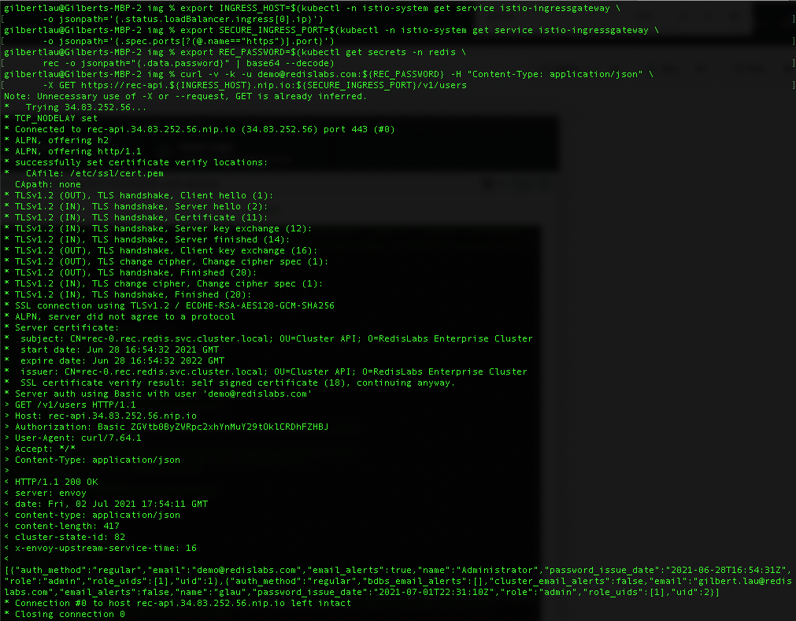
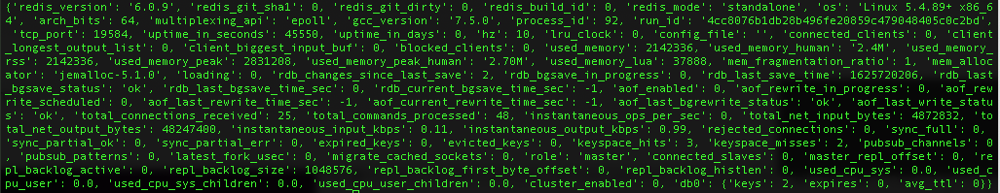

# Accessing a Redis Enterprise Database from outside a GKE cluster (Through Anthos Service Mesh Ingress) via one-way SSL and user creds (username/password)

## High Level Workflow
The following is the high level workflow which you will follow:
1. Clone this repo
2. Create a GKE cluster
3. Install Anthos Service Mesh (ASM)
4. Create a namespace for this deployment and deploy the Redis Enterprise Operator bundle
5. Deploy a Redis Enterprise Cluster (REC)
6. Deploy Ingress Gateway and Create routes for Redis Enterprise Cluster's HTTPS web access
7. Access Redis Enterprise Cluster's console
8. Update Ingress Gateway and Create routes for Redis Enterprise Cluster's API endpoint access
9. Verify the setup by issuing a curl REST API command
10. Create a new user in the Redis Enterprise Cluster (REC)
11. Create a Redis Enterprise Database with one-way SSL and role permissions
12. Create Ingress Gateway and Virtual Service for the Redis Enterprise Database instance
13. Verify the database connection via one-way SSL and user creds using a sample python program


#### 1. Clone this repo
```
git clone https://github.com/Redislabs-Solution-Architects/redis-enterprise-cloud-gcp
cd redis-enterprise-asm-ingress/gke/access-via-asm-one-way-ssl+creds
```


#### 2. Create a GKE cluster
```
export PROJECT_ID=$(gcloud info --format='value(config.project)')
export CLUSTER_NAME="glau-asm-gke-cluster"
export CLUSTER_LOCATION=us-west1-a

./create_cluster.sh $CLUSTER_NAME $CLUSTER_LOCATION
```


#### 3. Install Anthos Service Mesh (ASM)
Download ASM installation script
```
curl https://storage.googleapis.com/csm-artifacts/asm/install_asm_1.10 > install_asm
curl https://storage.googleapis.com/csm-artifacts/asm/install_asm_1.10.sha256 > install_asm.sha256
sha256sum -c --ignore-missing install_asm.sha256
chmod +x install_asm
```
Note: If you are running the ASM install on MacOS, you will need to install kpt as follows:
```
gcloud components install kpt
```  
Install Anthos Service Mesh (ASM)  
Please make sure you have all the required [GCP IAM permissions](https://cloud.google.com/service-mesh/docs/installation-permissions) before running the script below.  
```
./install_asm \
  --project_id $PROJECT_ID \
  --cluster_name $CLUSTER_NAME  \
  --cluster_location $CLUSTER_LOCATION  \
  --mode install \
  --output_dir ./asm-downloads \
  --enable_all
```
  

#### 4. Create a namespace for this deployment and deploy the Redis Enterprise Operator bundle
```
kubectl create namespace redis
kubectl config set-context --current --namespace=redis

kubectl apply -f https://raw.githubusercontent.com/RedisLabs/redis-enterprise-k8s-docs/v6.0.20-12/bundle.yaml
```
  

#### 5. Deploy a Redis Enterprise Cluster (REC)
```
kubectl apply -f - <<EOF
apiVersion: app.redislabs.com/v1alpha1
kind: RedisEnterpriseCluster
namespace: redis
metadata:
  name: rec
spec:
  nodes: 3
  redisEnterpriseNodeResources:
    requests:
      cpu: "1"
      memory: 4Gi
    limits:
      cpu: "2"
      memory: 4Gi
  persistentSpec:
    enabled: true
    storageClassName: "standard"
    volumeSize: 20Gi
EOF
```


#### 6. Deploy Ingress Gateway and Create routes for Redis Enterprise Cluster's HTTPS web access
Define gateway for HTTPS access:
```
export INGRESS_HOST=$(kubectl -n istio-system get service istio-ingressgateway \
       -o jsonpath='{.status.loadBalancer.ingress[0].ip}')
export SECURE_INGRESS_PORT=$(kubectl -n istio-system get service istio-ingressgateway \
       -o jsonpath='{.spec.ports[?(@.name=="https")].port}')

kubectl apply -f - <<EOF
apiVersion: networking.istio.io/v1alpha3
kind: Gateway
metadata:
  name: rec-ui-gateway
spec:
  selector:
    istio: ingressgateway # use istio default ingress gateway
  servers:
  - port:
      number: ${SECURE_INGRESS_PORT}
      name: https
      protocol: HTTPS
    tls:
      mode: PASSTHROUGH
    hosts:
    - rec-ui.${INGRESS_HOST}.nip.io
EOF
```
Configure routes for traffic entering via the gateway:
```
kubectl apply -f - <<EOF
apiVersion: networking.istio.io/v1alpha3
kind: VirtualService
metadata:
  name: rec-ui-service
spec:
  hosts:
  - rec-ui.${INGRESS_HOST}.nip.io
  gateways:
  - rec-ui-gateway
  tls:
  - match:
    - port: ${SECURE_INGRESS_PORT}
      sniHosts:
      - rec-ui.${INGRESS_HOST}.nip.io
    route:
    - destination:
        host: rec-ui
        port:
          number: 8443
EOF
```


#### 7. Access Redis Enterprise Cluster's console
Grab the password for demo@redislabs.com user for accessing REC's configuration manager (CM):
```
kubectl get secrets -n redis rec -o jsonpath="{.data.password}" | base64 --decode
```
Access the CM's login page using the following URL:
```
https://rec-ui.<$INGRESS_HOST>.nip.io:443

For example:
https://rec-ui.34.83.116.191.nip.io:443
```
Log in using demo@redislabs.com and the password collected above to view the cluster information in CM.


#### 8. Update Ingress Gateway and Create routes for Redis Enterprise Cluster's API access
Define gateway for API access:
```
export INGRESS_HOST=$(kubectl -n istio-system get service istio-ingressgateway \
       -o jsonpath='{.status.loadBalancer.ingress[0].ip}')
export SECURE_INGRESS_PORT=$(kubectl -n istio-system get service istio-ingressgateway \
       -o jsonpath='{.spec.ports[?(@.name=="https")].port}')

kubectl apply -f - <<EOF
apiVersion: networking.istio.io/v1alpha3
kind: Gateway
metadata:
  name: rec-api-gateway
spec:
  selector:
    istio: ingressgateway # use istio default ingress gateway
  servers:
  - port:
      number: ${SECURE_INGRESS_PORT}
      name: https
      protocol: HTTPS
    tls:
      mode: PASSTHROUGH
    hosts:
    - rec-api.${INGRESS_HOST}.nip.io
EOF
```
Configure routes for traffic entering via the gateway:
```
kubectl apply -f - <<EOF
apiVersion: networking.istio.io/v1alpha3
kind: VirtualService
metadata:
  name: rec-api-service
spec:
  hosts:
  - rec-api.${INGRESS_HOST}.nip.io
  gateways:
  - rec-api-gateway
  tls:
  - match:
    - port: ${SECURE_INGRESS_PORT}
      sniHosts:
      - rec-api.${INGRESS_HOST}.nip.io
    route:
    - destination:
        host: rec
        port:
          number: 9443    
EOF
```


#### 9. Verify the setup by issuing a curl REST API command
```
export INGRESS_HOST=$(kubectl -n istio-system get service istio-ingressgateway \
       -o jsonpath='{.status.loadBalancer.ingress[0].ip}')
export SECURE_INGRESS_PORT=$(kubectl -n istio-system get service istio-ingressgateway \
       -o jsonpath='{.spec.ports[?(@.name=="https")].port}')
export REC_PASSWORD=$(kubectl get secrets -n redis \
       rec -o jsonpath="{.data.password}" | base64 --decode)

curl -v -k -u demo@redislabs.com:${REC_PASSWORD} -H "Content-Type: application/json" \
       -X GET https://rec-api.${INGRESS_HOST}.nip.io:${SECURE_INGRESS_PORT}/v1/users
```  
You should see a similar output like below:



#### 10. Create a new user in the Redis Enterprise Cluster (REC)
A [user.json](./user.json) file is provided in this repo to create a new REC user.  The content of the file is as follows:
```
{
     "email": "gilbert.lau@redislabs.com",
     "password": "redis",
     "name": "gmflau",
     "email_alerts": true,
     "bdbs_email_alerts": ["1","2"],
     "role": "db_member",
     "auth_method": "regular"
}
```  
Run the following command to create the user:
```
curl -v -k -u demo@redislabs.com:${REC_PASSWORD} -H "Content-Type: application/json" \
       -X POST --data @user.json https://rec-api.${INGRESS_HOST}.nip.io:${SECURE_INGRESS_PORT}/v1/users
```


#### 11. Create a Redis Enterprise Database with one-way SSL and role permissions
```
kubectl apply -f - <<EOF
apiVersion: app.redislabs.com/v1alpha1
kind: RedisEnterpriseDatabase
namespace: redis
metadata:
  name: redis-enterprise-database
spec:
  memorySize: 100MB
  tlsMode: enabled
  rolesPermissions:
  - type: redis-enterprise
    role: "DB Member"
    acl: "Full Access"
EOF
```


#### 12. Create Ingress Gateway and Virtual Service for the Redis Enterprise Database instance
Gateway definition:
```
export INGRESS_HOST=$(kubectl -n istio-system get service istio-ingressgateway \
       -o jsonpath='{.status.loadBalancer.ingress[0].ip}')
export SECURE_INGRESS_PORT=$(kubectl -n istio-system get service istio-ingressgateway \
       -o jsonpath='{.spec.ports[?(@.name=="https")].port}')
export DB_PORT=$(kubectl get secrets -n redis redb-redis-enterprise-database \
       -o jsonpath="{.data.port}" | base64 --decode)

kubectl apply -f - <<EOF
apiVersion: networking.istio.io/v1alpha3
kind: Gateway
metadata:
  name: redis-db-gateway-wc
spec:
  selector:
    istio: ingressgateway # use istio default ingress gateway
  servers:
  - port:
      number: ${SECURE_INGRESS_PORT}
      name: https
      protocol: HTTPS
    tls:
      mode: PASSTHROUGH
    hosts:
    - "*.demo.rec.${INGRESS_HOST}.nip.io"
EOF
```
Routing definition:  
```
kubectl apply -f - <<EOF
apiVersion: networking.istio.io/v1alpha3
kind: VirtualService
metadata:
  name: redis-db-service
spec:
  hosts:
  - "*.demo.rec.${INGRESS_HOST}.nip.io"
  gateways:
  - redis-db-gateway-wc
  tls:
  - match:
    - port: ${SECURE_INGRESS_PORT}
      sniHosts:
      - redis-${DB_PORT}.demo.rec.${INGRESS_HOST}.nip.io
    route:
    - destination:
        host: redis-enterprise-database
        port:
          number: ${DB_PORT}
EOF
```


#### 13. Verify the database connection via one-way SSL and user creds using a sample python program
Copy the content of proxy_cert.pem from one of the REC pods to your machine:
```
kubectl cp rec-0:/etc/opt/redislabs/proxy_cert.pem ./proxy_cert.pem -c redis-enterprise-node
```  
Run test.py to verify the connection:
```
python test.py ${INGRESS_HOST} ${DB_PORT} gmflau redis
```
  
It should produce an output about the Redis Enterprise database's information as follows:



