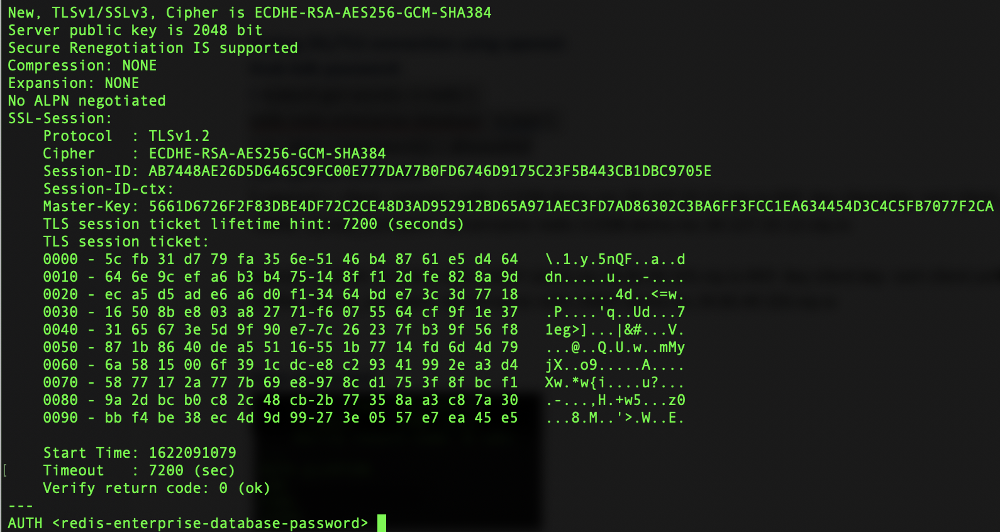
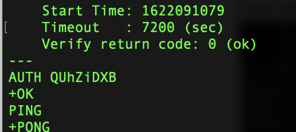
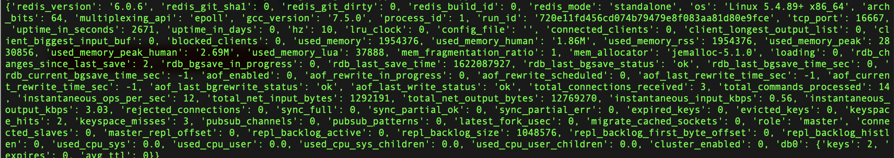

# Accessing a Redis Enterprise database from outside a GKE cluster (Using Nginx)

## High Level Workflow
The following is the high level workflow which you will follow:
1. Create a GKE cluster
2. Create a namespace for this deployment and deploy the Redis Enterprise Operator bundle
3. Deploy a Redis Enterprise Cluster (REC)
4. Deploy Nginx ingress controller
5. Create a Redis Enterprise database instance with TLS enabled
6. Create an Ingress resource for the Redis Enterprise cluster for web UI access
7. Create an Ingress resource for external traffic going into the Redis Enterprise database
8. Verify the connection using openssl
9. Connect to the Redis Enterprise database via a Python program
     

#### 1. Create a GKE cluster
```
./create_cluster.sh glau-gke-cluster us-west1-a
```


#### 2. Create a namespace for this deployment and deploy the Redis Enterprise Operator bundle
```
kubectl create namespace redis
kubectl config set-context --current --namespace=redis

VERSION=v7.2.4-12
kubectl apply -f https://raw.githubusercontent.com/RedisLabs/redis-enterprise-k8s-docs/$VERSION/bundle.yaml
```


#### 3. Deploy a Redis Enterprise Cluster (REC)
```
kubectl apply -f rec.yaml -n redis
```


#### 4. Deploy Nginx ingress controller
```
kubectl apply -f nginx-ingress-controller.yaml
```
Grab the external IP of the Nginx ingress controller for later use:
```
kubectl get service/ingress-nginx-controller -n ingress-nginx \
-o jsonpath='{.status.loadBalancer.ingress[0].ip}'
```


#### 5. Create a Redis Enterprise database instance with TLS enabled
Deploy a Redis Enterprise database:
```
kubectl apply -f redb.yaml -n redis
```


#### 6. Create an Ingress resource for the Redis Enterprise cluster for web UI access
Replace &lt;ingress-external-ip&gt; with external IP of the Nginx ingress controller from step 5 in rec-ingress.yaml. Then run:
```
kubectl apply -f rec-ingress.yaml -n redis
```
Grab the password for demo@redis.com user for accessing REC's configuration manager (CM):
```
kubectl get secrets -n redis rec  -o json | jq '.data | {password}[] | @base64d'
```
Access the CM's login page using the following URL:
```
https://rec.<ingress-external-ip>.nip.io:443

For example:
https://rec.34.82.246.32.nip.io:443
```
Log in using demo@redis.com and the password collected above to view the cluster information in CM.


#### 7. Create an Ingress resource for external traffic going into the Redis Enterprise database
Replace &lt;ingress-external-ip&gt; with external IP of the Nginx ingress controller from step 5 in redb-ingress.yaml.
Replace &lt;redis-enterprise-database-port&gt; with the Redis Enterprise database's listening port in redb-ingress.yaml.
Then run the following: 
```
kubectl apply -f redb-ingress.yaml -n redis
```


#### 8. Verify the connection using openssl
Grab the password of the Redis Enterprise database:
```
kubectl get secrets -n redis \
redb-redis-enterprise-database  -o json \
| jq '.data | {password}[] | @base64d'
```
Copy the content of proxy_cert.pem from one of the REC pods to your machine running **openssl** command later:
```
kubectl cp rec-0:/etc/opt/redislabs/proxy_cert.pem ./proxy_cert.pem -c redis-enterprise-node
```
Run the following to open a SSL session:
```
openssl s_client -connect redis-<redis-enterprise-database-port>.demo.rec.<ingress-external-ip>.nip.io:443 \
-CAfile ./proxy_cert.pem \
-servername redis-<redis-enterprise-database-port>.demo.rec.<ingress-external-ip>.nip.io

For example,
openssl s_client -connect redis-11338.demo.rec.34.127.23.12.nip.io:443 \
-CAfile ./proxy_cert.pem \
-servername redis-11338.demo.rec.34.127.23.12.nip.io
``` 
You should see a similar output as follows. Replace &lt;redis-enterprise-database-password&gt; with your Redis Enterprise database instance's password. Make sure there is a space after the password on MacOS. See below:

Send a **PING** command by entering PING followed by a blank space before hitting the **RETURN** button:



#### 9. Connect to the Redis Enterprise database via a Python program
Run test.py to verify the connection:
```
python test.py <ingress-external-ip> <redis-enterprise-database-port> <redis-enterprise-database-password>

For example,
python test.py 34.83.49.103 16667 QUhZiDXB 
```
It should produce output about the Redis Enterprise database's information as follows:

