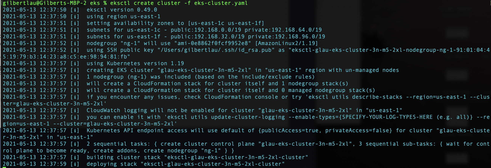
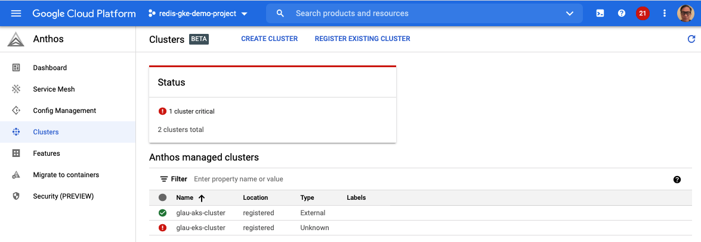
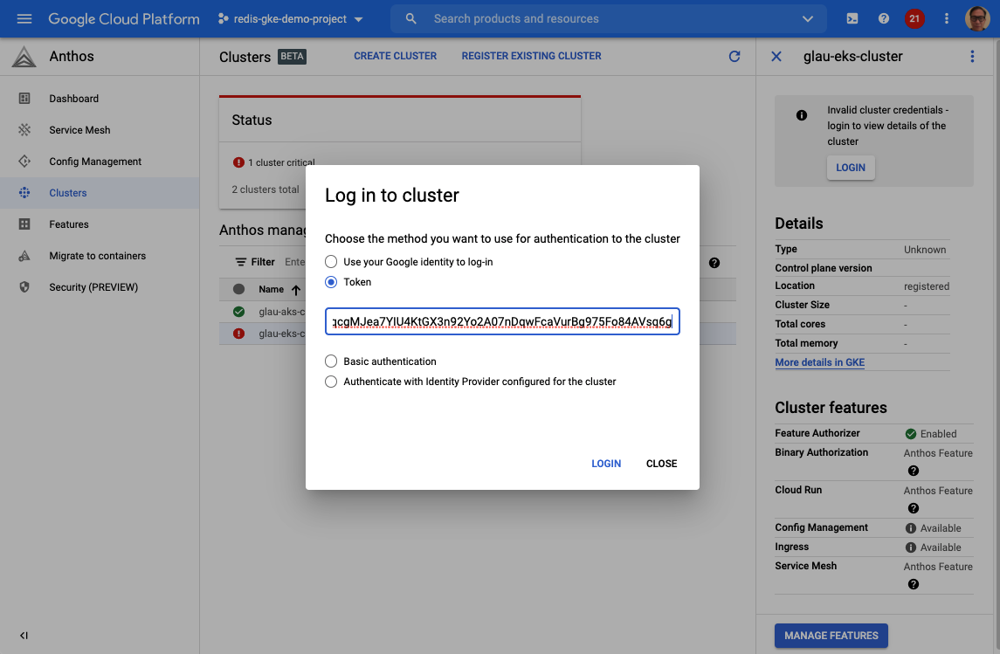
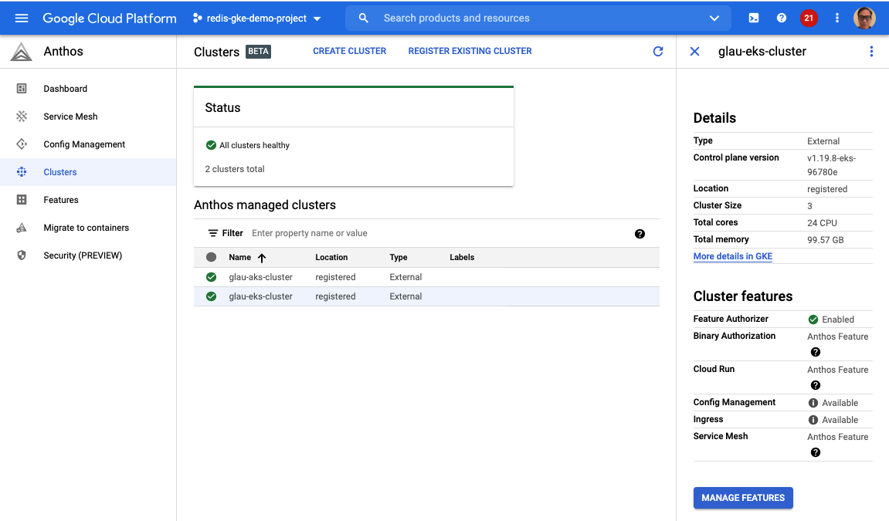
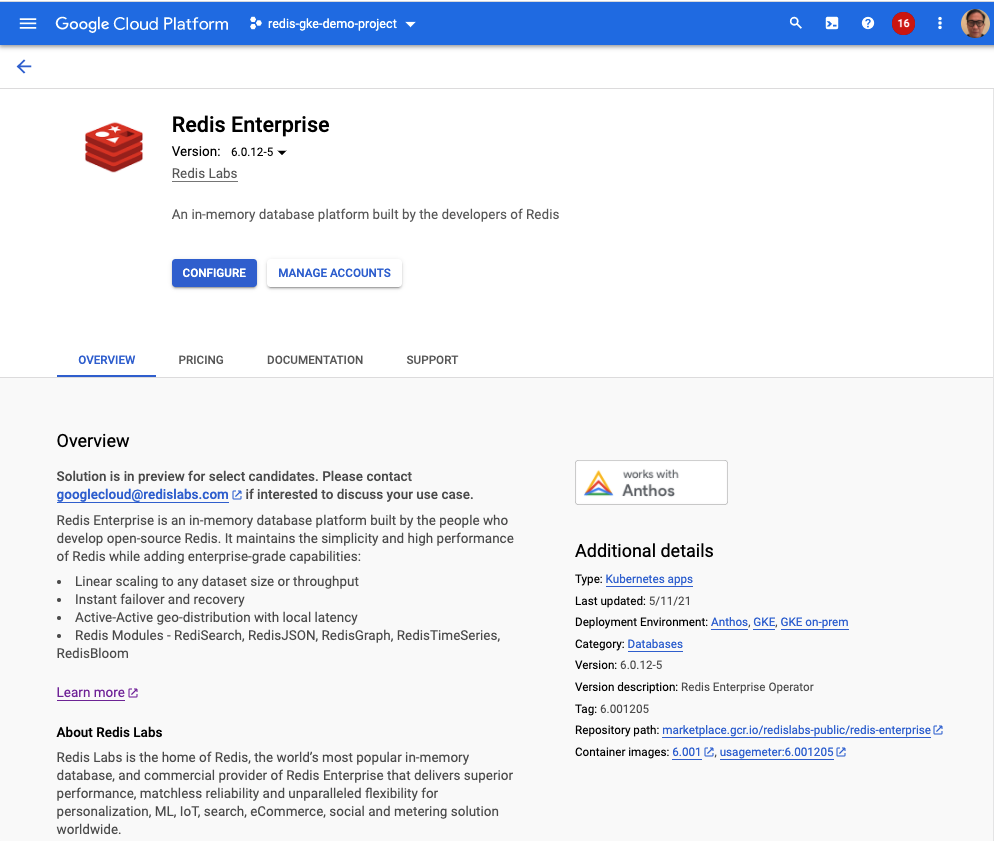
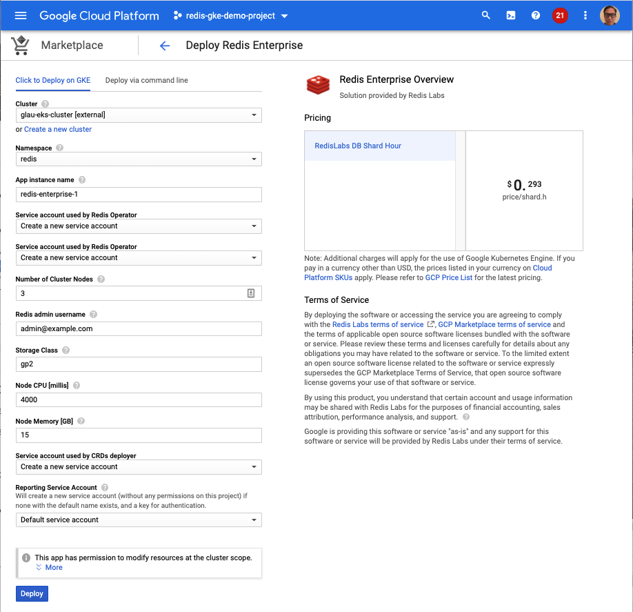
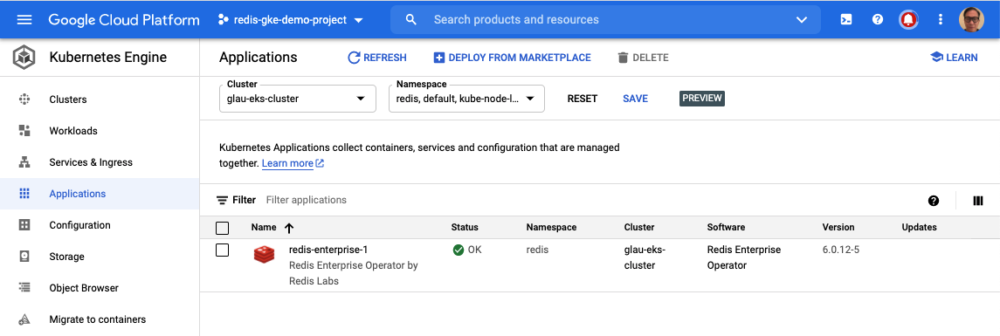
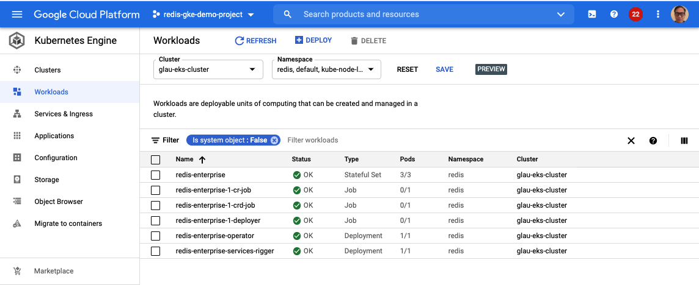
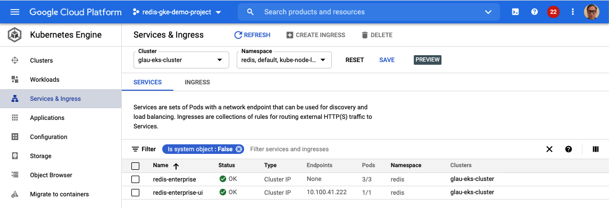
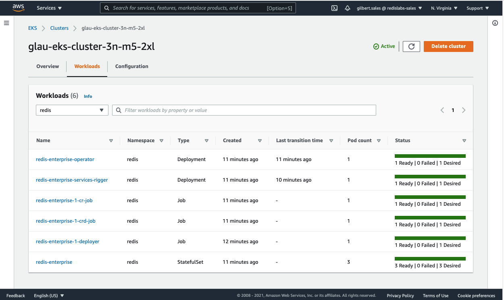

## How to deploy Redis Enterprise on GKE via GCP Marketplace to an Anthos attached EKS cluster

### High Level Workflow
The following is the high level workflow which you will follow:
1. Create an EKS cluster if you do not have one already
2. Register the EKS cluster as attached (external) Kubernetes cluster
3. Authenticate the attached EKS cluster using bearer token
4. Configure the attached EKS cluster to pull images from Google Container Registry (GCR)
5. Configure the attached EKS cluster to allow images on Marketplace's GCR being pulled from your deployment K8 namespace
6. Deploy Redis Enterprise on GKE via GCP Marketplace on your designated K8 namespace

#### 1. Create an EKS cluster 
Update eks-cluster.yaml in this repo for your deployement.  Minimum requirements to deploy Redis Enterprise on GKE is 3+ nodes and each with 8 or more vCPUs.
```
apiVersion: eksctl.io/v1alpha5
kind: ClusterConfig
metadata:
  name: glau-eks-cluster-3n-m5-2xl
  region: us-east-1
nodeGroups:
  - name: ng-1
    instanceType: m5.2xlarge
    desiredCapacity: 3
    ssh:
      allow: true # will use ~/.ssh/id_rsa.pub as the default ssh key
```
Run the following command to deploy the EKS cluster.  Install eksctl CLI if you have not installed already.
```
eksctl create cluster -f eks-cluster.yaml
```
You should see similar output after you hit RETURN. It will take about 10+ minutes to deploy the EKS cluster.



#### 2. Register the EKS cluster as attached Kubernetes cluster
Create a GCP service account with relevant roles to attach the cluster to GCP
```
export PROJECT=$(gcloud config get-value project)
gcloud iam service-accounts create anthos-hub \
	--project=${PROJECT}
gcloud iam service-accounts list \
	--project=${PROJECT}
gcloud projects add-iam-policy-binding ${PROJECT} \
--member="serviceAccount:anthos-hub@${PROJECT}.iam.gserviceaccount.com" \
--role="roles/gkehub.connect"
```

Generate a JSON key from the service account
```
gcloud iam service-accounts keys create ./anthos-hub-svc.json \
  --iam-account="anthos-hub@${PROJECT}.iam.gserviceaccount.com" \
  --project=${PROJECT}
```

Register the EKS cluster
```
gcloud container hub memberships register <MEMBERSHIP-NAME> \
--context=<KUBECONFIG-CONTEXT> \
--kubeconfig=<KUBECONFIG-PATH> \
--service-account-key-file=<SERVICE-ACCOUNT-KEY-PATH>

For example,
gcloud container hub memberships register glau-eks-cluster \
--context=gilbert.sales@glau-eks-cluster-3n-m5-2xl.us-east-1.eksctl.io \
--kubeconfig=/Users/gilbertlau/.kube/config \
--service-account-key-file=./anthos-hub-svc.json
``` 

You should see your newly brought EKS cluster with critcal status below.  Once it is authenticated in step 3, the EKS cluster will turn into healthy state.



#### 3. Authenticate the attached EKS cluster using bearer token
Create and apply the cloud-console-reader RBAC role
```
cat <<EOF > cloud-console-reader.yaml
kind: ClusterRole
apiVersion: rbac.authorization.k8s.io/v1
metadata:
  name: cloud-console-reader
rules:
- apiGroups: [""]
  resources: ["nodes", "persistentvolumes"]
  verbs: ["get", "list", "watch"]
- apiGroups: ["storage.k8s.io"]
  resources: ["storageclasses"]
  verbs: ["get", "list", "watch"]
EOF
kubectl apply -f cloud-console-reader.yaml
```

Set up a service account (KSA - Kubernetes service account)
```
KSA_NAME=ksa-aks-sa-1
kubectl create serviceaccount ${KSA_NAME}
kubectl create clusterrolebinding ${KSA_NAME}-view-clusterrole-binding \
--clusterrole view --serviceaccount default:${KSA_NAME}
kubectl create clusterrolebinding ${KSA_NAME}-cloud-console-reader-binding \
--clusterrole cloud-console-reader --serviceaccount default:${KSA_NAME}
```

Bind the cluster-admin role to the KSA above to allow deployment of a Kubernetes application from GCP Marketplace
```
kubectl create clusterrolebinding ${KSA_NAME}-cluster-admin-binding \
--clusterrole cluster-admin --serviceaccount default:${KSA_NAME}
```

Get the KSA’s bearer token to log into GCP console
```
SECRET_NAME=$(kubectl get serviceaccount ksa-aks-sa-1 -o jsonpath='{$.secrets[0].name}')
kubectl get secret ${SECRET_NAME} -o jsonpath='{$.data.token}' | base64 --decode
```
Use the output (bearer token) from the above command to log the cluster into GCP


You should see the attached EKS cluster now in a healthy state



#### 4. Configure the attached EKS cluster to pull images from Google Container Registry (GCR)
Create a service account to pull images from GCR
```
gcloud iam service-accounts create gcr-sa \
	--project=${PROJECT}
gcloud iam service-accounts list \
	--project=${PROJECT}
gcloud projects add-iam-policy-binding ${PROJECT} \
--member="serviceAccount:gcr-sa@${PROJECT}.iam.gserviceaccount.com" \
--role="roles/storage.objectViewer"
gcloud iam service-accounts keys create ./gcr-sa.json \
  --iam-account="gcr-sa@${PROJECT}.iam.gserviceaccount.com" \
  --project=${PROJECT}
```

Set up your application-system namespace with a Secret to access Container Registry
```
kubectl create ns application-system
JSON_KEY_FILENAME=./gcr-sa.json
IMAGEPULLSECRET_NAME=gcr-json-key
kubectl create secret docker-registry $IMAGEPULLSECRET_NAME \
  --namespace="application-system" \
  --docker-server=gcr.io \
  --docker-username=_json_key \
  --docker-password="$(cat $JSON_KEY_FILENAME)"

kubectl patch sa default -n application-system -p '"imagePullSecrets": [{"name": "gcr-json-key" }]'
```

#### 5. Configure the attached EKS cluster to allow images on Marketplace's GCR being pulled from your deployment K8 namespace
```
NAMESPACE=redis
kubectl create ns $NAMESPACE
JSON_KEY_FILENAME=./gcr-sa.json
IMAGEPULLSECRET_NAME=gcr-json-key
kubectl create secret docker-registry $IMAGEPULLSECRET_NAME \
  --namespace=$NAMESPACE \
  --docker-server=gcr.io \
  --docker-username=_json_key \
  --docker-password="$(cat $JSON_KEY_FILENAME)"

kubectl annotate namespace $NAMESPACE marketplace.cloud.google.com/imagePullSecret=$IMAGEPULLSECRET_NAME
```
You would repeat this step for any additional K8 namespace to deploy Redis Enterprise on GKE via GCP Marketplace


#### 6. Deploy Redis Enterprise on GKE via GCP Marketplace on your designated K8 namespace
Follow the on-screen instructions below to deploy Redis Enterprise on GKE via GCP Marketplace


---

---

---

---

---

---

---
This is what is shown in AWS Console

