# Provision a fully managed Redis Enterprise database in Google Cloud Marketplace

1. Subscribe to Redis Enterprise in Google Cloud Marketplace.
Look up and locate **Redis Enterprise Cloud Flexible - Pay as You Go** in Google Cloud Marketplace.  Once you are on the product page, click **SUBSCRIBE**
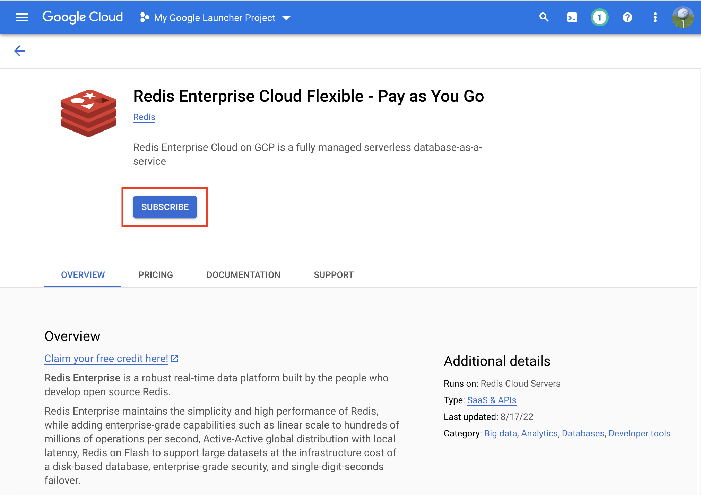
Review the Terms and click **SUBSCRIBE**

Click **GO TO PRODUCT PAGE** in the pop-up window
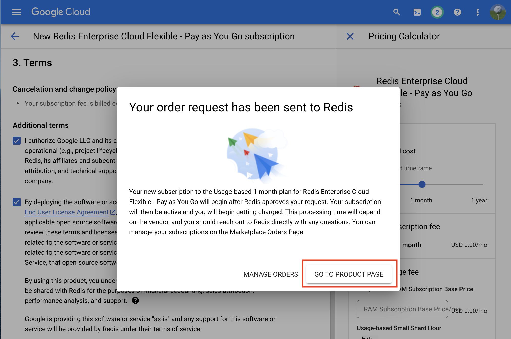
Click **MANAGE ON PROVIDER**
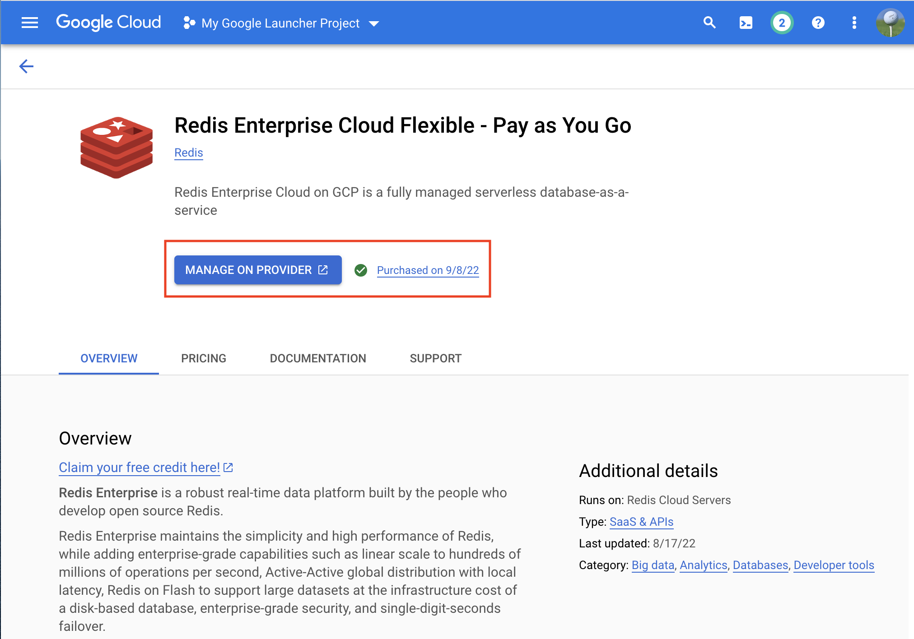
Click **OK** and it will bring you to Redis Enterprise Cloud page

1. Create a Redis Enterprise database instance.
In our case, we use an existing gmail email account to log into Redis Enterprise Cloud
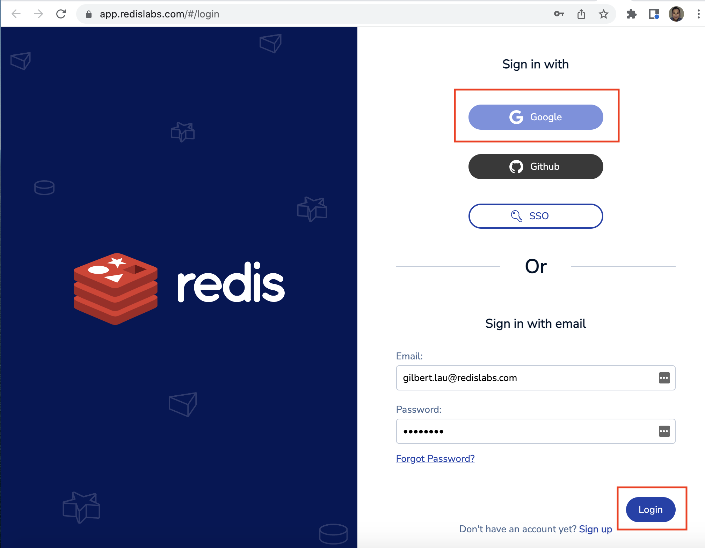

Click **Map account** to map the newly created GCP Marketplace subscription
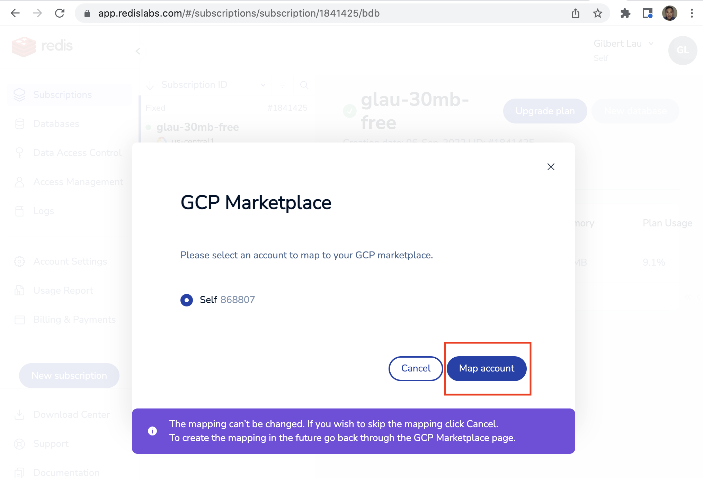
Click **+ New subscription** to create a new Redis Enterprise Cluster subscription
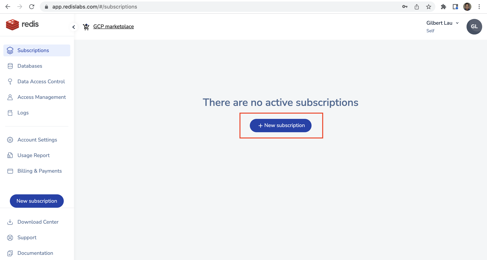
Select **Flexible plans**
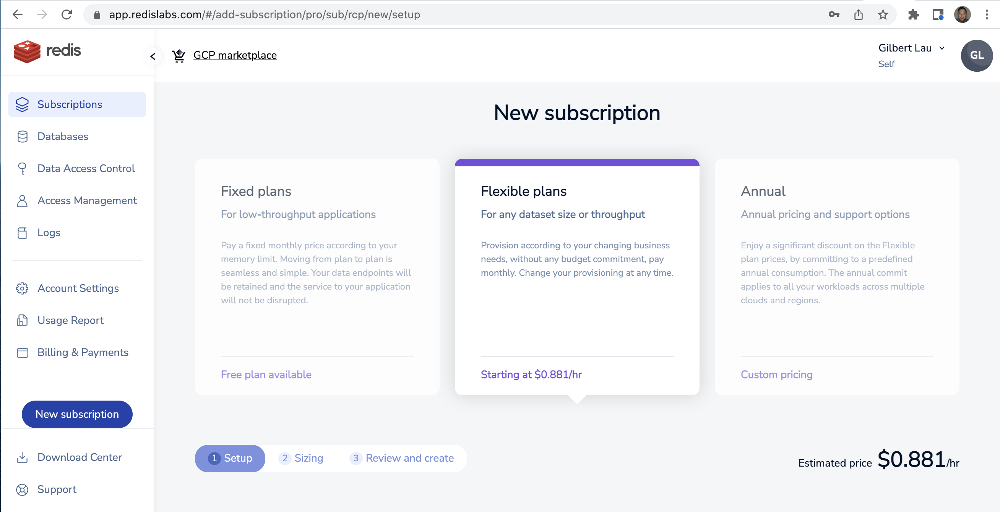
Choose **Google Cloud Platform**, select a GCP region and provide a name for your subscription. Then click **Continue**
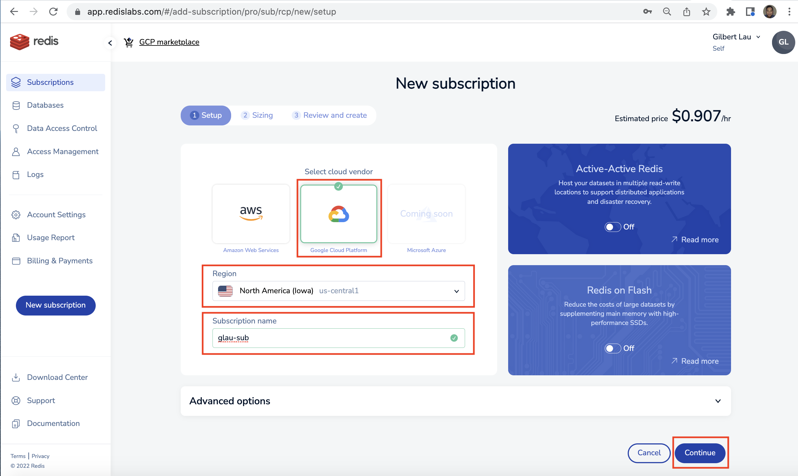
Click the **+** sign to create a new database
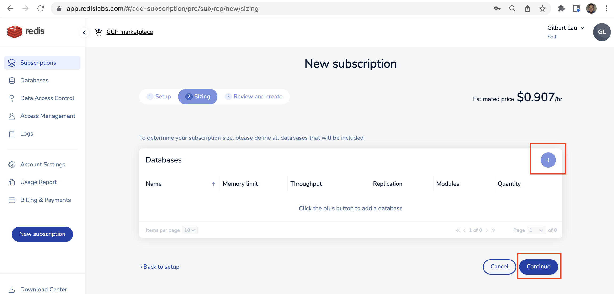
Create a new database as shown in the screen shot below. Then click **Save database**

Then click **Continue**
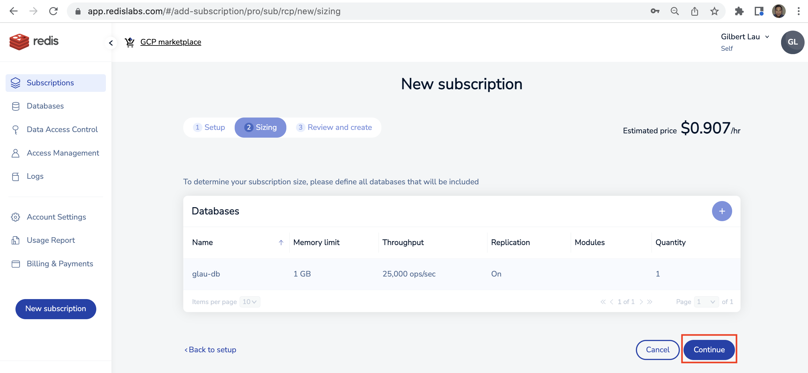
Review your subscription settings and click **Create subscription**

It will take about 5 minutes to complete
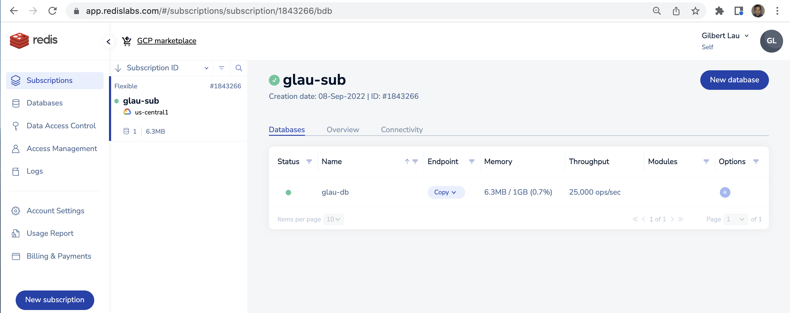
Copy the **Private endpoint** information for later use
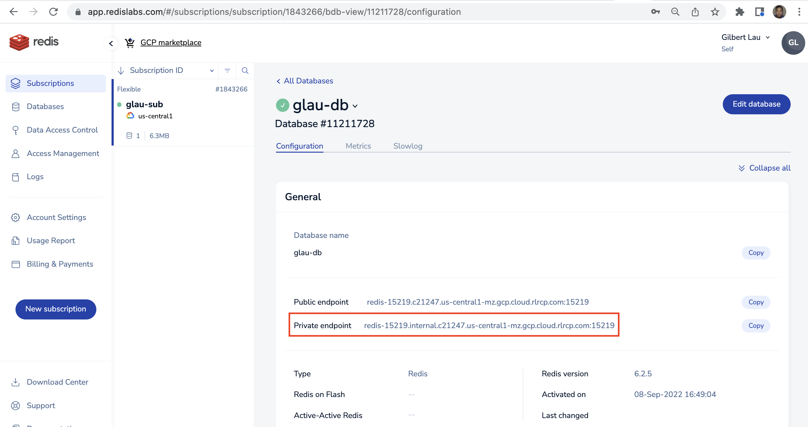
Copy the **Default user password** information for later use
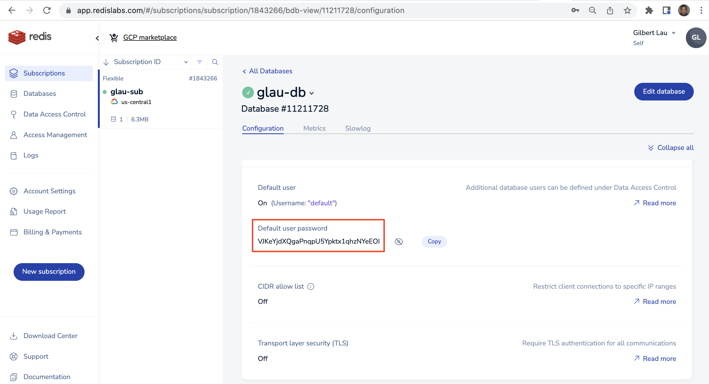

1. Peer your VPC with Redis's managed VPC.
Select **Connectivity** tab as follows. Then click **+ Add peering**
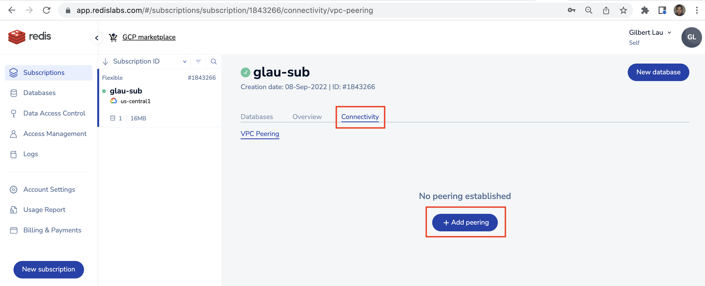
Provide the **Project ID** and **Network name** your GKE cluster belongs to. Then follow the on-screen instructions to run the provided **Google cloud command**
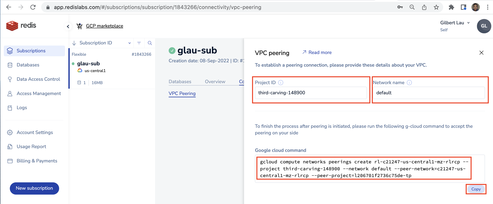
It will take a couple minutes to complete peering

  
Important notes:
- You cannot connect to a fully managed Redis Enterprise database (redis) instance via private endpoint from a GKE cluster without peering your VPC to Redis's managed VPC.
