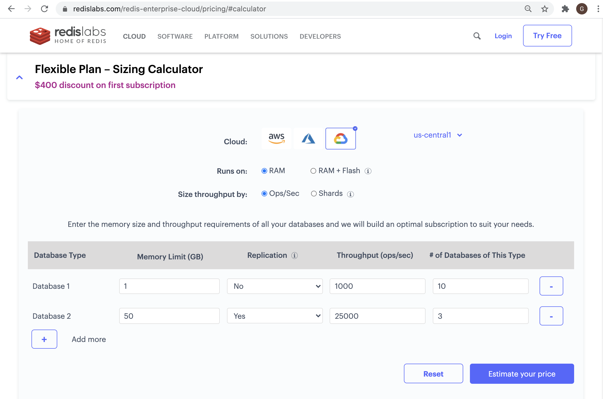
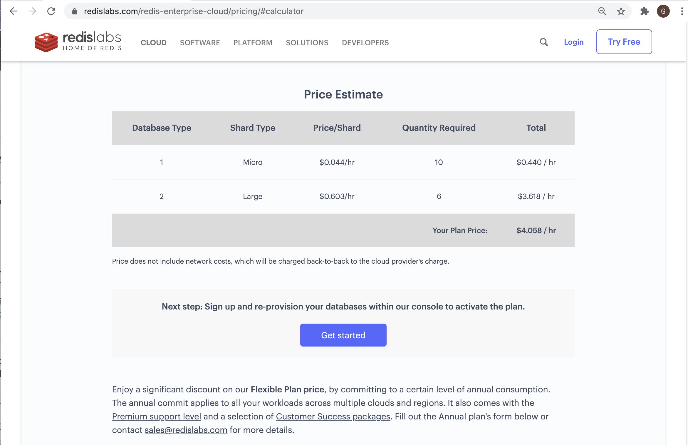

### This is how to estimate pricing for running fully managed Redis Enterprise on GCP

This informatin applies to the following scenarios w.r.t to pricing estimate:
* Customers subscribing to fully managed Redis Enterprise DBaaS through GCP Marketplace
* Customers subscribing to fully managed Redis Enterprise DBaaS directly from Redis Enterprise Cloud (http://app.redislabs.com)

This [URL](https://redislabs.com/redis-enterprise-cloud/pricing/#calculator) brings you to the Sizing Calculator page for **Flexible Plan** - a.k.a. PayGo Plan as shown below:

A simple set of steps below to create the pricing estimate for your subscription:
1. Pick Google Cloud as the **Cloud** provider
2. Choose the GCP region for your subscription
3, Choose between **RAM** or **RAM + FLash**
4. Size throughput by **Ops/Sec** or **Shards**
5. Provide each of your databases' specification by rows

*Note: You will need to create pricing estimate for each of your GCP regions one at a time*

Below is a pricing estimate sample:

You can enjoy a significant discount on the Flexible Plan price by committing to a certain level of annual consumption. The annual plan includes the [Premium support level](https://redislabs.com/deployment/support/) and a selection of [Customer Success packages](https://redislabs.com/deployment/customer-success/). [Here](https://redislabs.com/redis-enterprise-cloud/pricing/#form) is the request form or contact <sales@redislabs.com> to inquire about an annual subscription discount.
