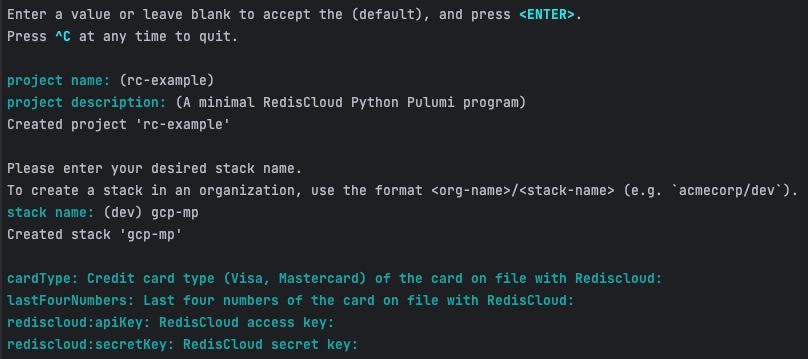
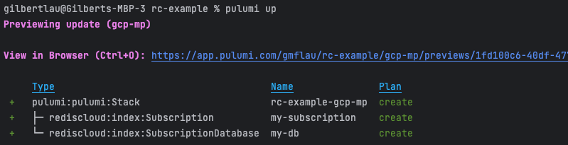

# Managing a Redis Cloud provider with Pulumi

## This guide provides instructins to use Pulumi to provision Redis Enterprise on Google Cloud

## High Level Workflow
The following is the high level workflow which you will follow:
1. Clone this repo
2. Instal Pulumi
3. Set up a Pulumi project and Install the Redis Cloud provider package
4. Create a subscription and a database in Redis Enterprise Cloud Direct or Google Cloud Marketplace
5. Delete the subscription
    

#### 1. Clone this repo 
```base
git clone https://github.com/Redislabs-Solution-Architects/redis-enterprise-cloud-gcp
cd pulumi
```
    
#### 2. Install Pulumi
Follow this [link](https://www.pulumi.com/docs/install/) to install Pulumi if you have done so already
    
#### 3. Set up a Pulumi project and Install the Redis Cloud provider package
```bash
mkdir my-redis-project
cd my-redis-project
pulumi new rediscloud-python
```
You will respond to the prompts similar to the below screenshot:

If you plan to create a subscription in Redis Enterprise Cloud Direct account, proceed to section 4a. For Google Cloud Marketplace account, proceed to section 4b.
    
    
#### 4. Create a subscription and a database in Redis Enterprise Cloud Direct or Google Cloud Marketplace
##### 4a. Redis Enterprise Cloud Direct
You'll need to answer cardType, lastFourNumbers, rediscloud:apiKey, and rediscloud:secretKey.
```bash
cp ../rec-direct/__main__.py .
```
Run the follwoing command and follow the prompts to provision your subscription:
```bash
pulumi up
```
        
##### 4b. Google Cloud Marketplace
Since this is for Google Cloud Marketplace, you'll hit the `enter` or `return` key for cardType and lastFourNumbers as the deployment will be charged to your Google Cloud Marketplace's billing account. That said, you'll need to provide your Redis Cloud Access Key for rediscloud:apiKey` and Redis Cloud Secret Key for `rediscloud:secretKey` only.
```bash
cp ../gcp-mp/__main__.py .
```
Run the follwoing command and follow the prompts to provision your subscription:
```bash
pulumi up
```
    
In either 4a or 4b, you should see output similar to the below screenshot:

     
    
#### 5. Delete the subscription
Run the follwoing command and follow the prompts to delete your subscription:
```bash
pulumi destroy
```
You should see output similar to the below screenshot:


