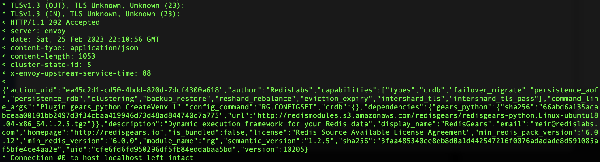

###  Ingest Quickstart Guide for Redis Data Integration on Google Cloud

Redis Data Integration (RDI) currently supports two scenarios namely [Ingest](https://redis-data-integration.docs.dev.redislabs.com/ingest-qsg.html) and [Write Behind](https://redis-data-integration.docs.dev.redislabs.com/write-behind-qsg.html). 

In **Ingest**, RDI mirrors the application primary database to Redis using a Capture Data Change (CDC) tool. RDI transforms the database model and types to Redis model and types. This scenario is useful when the application database is not performant and scalable enough to serve the read queries. RDI helps offloading all read queries to Redis.

The high-level architecture for this guide is as follows:
* Source: Google Cloud SQL for PostgreSQL database instance
* Target: Redis Enterprise Cloud on Google Cloud
* Redis Data Integration (RDI): RDI and RDI DB (on Redis Enterprise) in a Google Compute Engine VM


## Prerequisites:
Prior to running this lab, please ensure following pre-requisites are installed and configured.
- [gcloud CLI](https://cloud.google.com/sdk/docs/install)
- [PostgreSQL Client](https://www.timescale.com/blog/how-to-install-psql-on-mac-ubuntu-debian-windows/)
- Redis CLI (redis-cli)

## High Level Workflow
The following is the high level workflow which you will follow:
1. Create the Google Compute Engine from a pre-built image
2. Create the Source DB - Cloud SQL for PostgreSQL
3. Create the Target DB in Redis Enterprise Cloud on Google Cloud (app.redislabs.com) fixed plan on GCP's us-central1, db password => redis
4 Set up the RDI VM
5. Start Debezium server
6. Run RDI (jobs)
7. Verify data is ingested into Target DB (Redis)


#### 1. Create the Google Compute Engine from a pre-built image
Modify the environment variables' value for your environment.
```
export RDI_VM=glau-rdi-vm-00
export PROJECT_ID=$(gcloud info --format='value(config.project)')
export NETWORK=glau-vpc-network
export SUBNET=us-central1-subnet
export ZONE=us-central1-a

gcloud compute instances create $RDI_VM \
    --image=redis-rdi-vm-image-20230228-03\
    --image-project=$PROJECT_ID \
    --machine-type=e2-medium \
    --zone=$ZONE \
    --network=$NETWORK \
    --subnet=$SUBNET \
    --scopes=cloud-platform 
```

#### 2. Create the Source DB - Cloud SQL for PostgreSQL
Note: **database-flags=cloudsql.logical_decoding=on** enables logical replication workflows and change data capture (CDC) workflows which is required by RDI.
SSH into the RDI VM:
```
gcloud compute ssh $RDI_VM --zone=$ZONE
```
Clone this repo:
```
git clone https://github.com/Redislabs-Solution-Architects/redis-enterprise-cloud-gcp
pushd redis-enterprise-cloud-gcp/rdi
```
Create PostgreSQL instance:
```
export RDI_VM=glau-rdi-vm-00
export ZONE=us-central1-a
export POSTGRESQL_INSTANCE=glau-postgresql-instance
export RDI_VM_IP=$(gcloud compute instances describe $RDI_VM --zone=$ZONE --format='get(networkInterfaces[0].accessConfigs[0].natIP)')

gcloud sql instances create $POSTGRESQL_INSTANCE \
--database-version=POSTGRES_14 \
--cpu=2 \
--memory=8GiB \
--zone=$ZONE \
--authorized-networks=$RDI_VM_IP \
--root-password=postgres \
--database-flags=cloudsql.logical_decoding=on
```
    
By default, PostgreSQL database superuser (postgres) does not have permission to create a replication slot which is required by RDI.  Run the following commands to grant the permission:  
```
gcloud sql connect $POSTGRESQL_INSTANCE --user postgres < alter_postgres_replication.sql
```
Run the following command to populate test data:
```
gcloud sql connect $POSTGRESQL_INSTANCE --user postgres < sql_batch_file.sql
```
Move back to the home directory:
```
popd
```

#### 3. Create the Target DB in Redis Enterprise Cloud on Google Cloud
Create a fully managed Redis Enterprise database in Google Cloud with HA (replication) enabled:
Capture the Public Endpoint information for later use:

Make sure High availability is On as RDI requires replication and sends WAIT commands:

Capture the default user's password for later use:


#### 4. Set up the RDI VM
If your previous SSH session to the RDI VM has been terminated, you need to SSH into the RDI VM again as follows:
```
gcloud compute ssh $RDI_VM --zone=$ZONE
```
Install Redis Enterprise:
```
pushd rec
sudo ./install.sh -y
popd
```
   
Set up a Redis Enterprise Cluster by accessing https://<External IP of RDI_VM>:8443    
Note: You can run this commmand: `gcloud compute instances describe $RDI_VM --zone=$ZONE --format='get(networkInterfaces[0].accessConfigs[0].natIP)'` to retrieve the external IP of the RDI VM.   
Follow the on-screen instructions below to set up the Redis Enterprise Cluster:

Enter `redislabscluster.local` for Cluster name (FQDN):

Click "Next" to continue as no key is required for this lab:

Set up Admin username and password:

Verify a single node Redis Enterprise Cluster:


   
Inside the RDI VM, install Redis Gears:
```
curl -v -k -s -u "redis@redis.com:redis" -F "module=@./gears/redis-gears.zip" https://localhost:9443/v2/modules
```
You will see the below output from the command above:

Verify Redis Gears is installed on the Redis Enterprise Cluster:


   
Create RDI database:
```
redis-di create
```
We will take all the default values except Host/IP of Redis Enterprise Cluster as `localhost`, Redis Enterprise Cluster username as `redis@redis.com`, and Redis Enterprise Cluster's password as `redis`.
```
Host/IP of Redis Enterprise Cluster (service name in case of k8s): localhost
Redis Enterprise Cluster username with either DB Member, Cluster Member or Cluster Admin roles: redis@redis.com
Redis Enterprise Cluster Password: redis 
API Port of Redis Enterprise Cluster [9443]: 
Port of RDI Database [12001]: 
Memory for RDI Database (in MB) [100]: 
Number of database server-side shards [1]: 
In-memory database replication [y/N]: 
Password for the new RDI Database. Hit Enter for no password, otherwise use alphanumeric characters with zero or more of the following: ! & # $ ^ < > - []: redis
Please confirm the new RDI database password: redis
Creating new RDI database:
 name: redis-di-1
 port: 12001
 memory: 100MB
 shards: 1
 replication: False
New instance created on port 12001:
 DNS: redis-12001.redislabscluster.local
 ADDR: 10.122.15.196
INFO - Trying to establish connection to redis-12001.redislabscluster.local on port 12001
INFO - Trying to establish connection to 10.122.15.196 on port 12001
Setting up RDI Engine on port 12001
Successfully configured RDI database on port 12001
Context default added successfully
INFO - Context default added successfully
```   

Update Debezium's applciation.properties file:
```
export POSTGRESQL_INSTANCE=glau-postgresql-instance
export POSTGRESQL_INSTANCE_IP=$(gcloud sql instances describe $POSTGRESQL_INSTANCE | yq eval '.ipAddresses[] | select(.type == "PRIMARY") | .ipAddress')

mv ./debezium-server/conf/application.properties ./debezium-server/conf/application.properties.bak
envsubst < ./debezium-server/conf/application.properties.bak > ./debezium-server/conf/application.properties
```
   
Update ./rdi-postgresql/config.yaml:
```
export REDIS_TARGET_DB_HOST=<Redis Target db endpoint>
export REDIS_TARGET_DB_PORT=<Redis Target db endpoint port>

mv ./rdi-postgresql/config.yaml ./rdi-postgresql/config.yaml.bak
envsubst < ./rdi-postgresql/config.yaml.bak > ./rdi-postgresql/config.yaml
```

5. Start Debezium server
```
pushd debezium-server
./run.sh &
popd
```

6. Deploy RDI (jobs)
```
pushd rdi-postgresql
redis-di deploy
popd
```
You should see the following prompt and response:
```
INFO - Reading redis.emp.yaml job
RDI Database Password []: 
Deploying settings to 10.122.15.197:12001
INFO - Connected to target database
Done
```

7. Verify data is ingested into Target DB (Redis)
```
redis-cli -h $REDIS_TARGET_DB_HOST -p $REDIS_TARGET_DB_PORT
```
Verify if all keys are replicated
```
keys *
```
Validate data transforation:
```
hgetall emp:user_id:1
```

